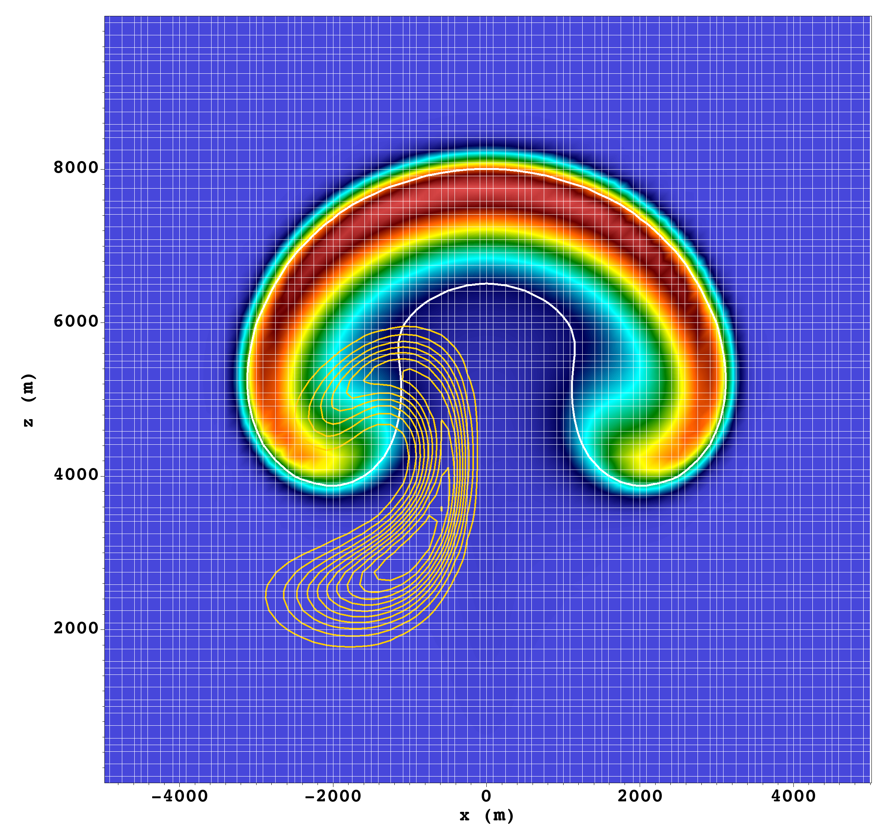

# JEXPRESSO
A research software for the numerical solution of a system of arbitrary conservation laws using continuous spectral elements. DISCLAIMER: this is WIP. Its GPU expansion is also under development. 

If you are interested in contributing, please get in touch.

# Some notes on using JEXPRESSO

To install and run the code assume Julia 1.9.3

## Setup with CPUs

```bash
>> cd $JEXPRESSO_HOME
>> julia --project=. -e "using Pkg; Pkg.instantiate(); Pkg.API.precompile()"
```
followed by the following:

Push problem name to ARGS
You need to do this only when you run a new problem
```bash
julia> push!(empty!(ARGS), EQUATIONS::String, EQUATIONS_CASE_NAME::String);
julia> include("./src/Jexpresso.jl")
```

* PROBLEM_NAME is the name of your problem directory as $JEXPRESSO/src/problems/problem_name
* PROBLEM_CASE_NAME is the name of the subdirectory containing the specific setup that you want to run: 

The path would look like 
```$JEXPRESSO/src/problems/PROBLEM_NAME/PROBLEM_CASE_NAME```

Example 1: to solve the 2D Euler equations with buyoancy and two passive tracers defined in `src/problems/CompEuler/thetaTracers` you would do the following:
```bash
julia> push!(empty!(ARGS), "CompEuler", "thetaTracers");
julia> include("./src/Jexpresso.jl")
```




Example 2: to solve the 1D wave equation  defined in `src/problems/CompEuler/wave1d` you would do the following:
```bash
julia> push!(empty!(ARGS), "CompEuler", "wave1d");
julia> include("./src/Jexpresso.jl")
```


For ready to run tests, there are the currently available equations names:

* CompEuler (option with total energy and theta formulation)

The code is designed to create any system of conservsation laws. See CompEuler/case1 to see an example of each file.
Details will be given in the documentation (still WIP). Write us if you need help.

More are already implemented but currently only in individual branches. They will be added to master after proper testing.

## Plotting
For plotting we rely on [Makie](https://github.com/MakieOrg/Makie.jl). If you want to use a different package,
modify ./src/io/plotting/jplots.jl accordinly.

For non-periodic 2D tests, the output can also be written to VTK files by setting the value "vtk" for the usier_input key :outformat

## Contacts
[Simone Marras](mailto:smarras@njit.edu), [Yassine Tissaoui](mailto:yt277@njit.edu)
