# 

| **Documentation** |
|:------------ |
 [](https://smarras79.github.io/Jexpresso/dev/) [](https://smarras79.github.io/Jexpresso/dev/) |
|**Build Status** |
| [](https://github.com/smarras79/Jexpresso/actions/workflows/CI.yml?query=branch%3Amaster) [](https://github.com/smarras79/Jexpresso/actions/workflows/Documentation.yml?query=branch%3Amaster)
| **Contacts**  |
| [](mailto:smarras@njit.edu) |
| [](mailto:tissaoui@wisc.edu) |
| [](mailto:hang.wang@njit.edu) |
| **Citation** |
| [](https://doi.org/10.48550/arXiv.2401.05624) |

# JEXPRESSO
A CPU and GPU research software for the numerical solution of a system of arbitrary conservation laws using **continuous spectral elements** and finite differences in **1D, 2D, 3D**. DISCLAIMER: this will always be WIP! Contact us to join the team of developers!

Suggested Julia version: 1.11.9

# A note about the use of AI
Jexpresso has been developed by humans since 2021 and continues to be so. Since Spring 2026, AI has been assisting the developers for new problems additions, debugging, and code's documentation. As AI becomes more reliable, we foresee an increased use of it for code development under the direct supervision of a human expert. 
The Jexpresso core team uses Claude whereas some external developers have been successfully using OpenAI's Codex for their own implementations.

# Table of Contents

- [Installation](#installation)
- [Equations](#equations)
  1. [1D wave equation](#1-1d-wave-equation)
  2. [1D shallow water](#2-1d-shallow-water)
  3. [2D Helmholtz](#3-2d-helmholtz)
  4. [2D scalar advection-diffusion](#4-2d-scalar-advection-diffusion)
  5. [2D Euler equations of compressible flows with gravity and passive chemicals](#5-2d-euler-equations-of-compressible-flows-with-gravity-and-passive-chemicals)
  6. [3D Euler equations of compressible flows with gravity](#6-3d-euler-equations-of-compressible-flows-with-gravity)
- [Showcase](#turbulent-abl)
  - [Planet Saturn](#planet-saturn)
  - [Turbulent ABL](#turbulent-abl)
  - [Shallow cumuli](#shallow-cumuli)
- [Examples available in this branch](#examples-available-in-this-branch)
  - [1D shock tube with dynamic SGS (DynSGS) for shock capturing](#1d-shock-tube-with-dynamic-sgs-dynsgs-for-shock-capturing)
  - [1D acoustic wave](#1d-acoustic-wave)
  - [Flow at Mach 3 with forward-facing step](#flow-at-mach-3-with-forward-facing-step)
  - [Kelvin-Helmholtz instability](#kelvin-helmholtz-instability)
  - [Solid elasticicy](#Solid-elasticity)
  - [MHD: magnetized Kelvin-Helmholtz instability](#magneto-hydrodynamics-mhd-magnetized-kelvin-helmholtz-instability)
  - [MHD: Orszag-Tang vortex](#magneto-hydrodynamics-mhd-orszag-tang-vortex)
  - [Cloud simulation: shallow cumuli with BOMEX conditions](#cloud-simulation-shallow-cumuli-with-bomex-conditions)
  - [Shallow water on a spherical shell](#shallow-water-on-a-spherical-shell)
  - [2D Euler equations with buoyancy and two passive tracers](#2d-euler-equations-with-buoyancy-and-two-passive-tracers)
  - [3D Euler equations with buoyancy](#3d-euler-equations-with-buoyancy)
  - [Spectral convergence of the SEM: doubly periodic Poisson problem](#spectral-convergence-of-the-sem-doubly-periodic-poisson-problem) (SEM direct/AMG, static condensation, pseudo-spectral, FFT)
  - [Laguerre semi-infinite element test suite](#laguerre-semi-infinite-element-test-suite)
    - [Test 1: 1D wave equation with Laguerre absorbing layers](#test-1-1d-wave-equation-with-laguerre-semi-infinite-element-absorbing-layers)
    - [Test 2: 1D wave train for linearized shallow water equations](#test-2-1d-wave-train-for-linearized-shallow-water-equations)
    - [Test 3: 2D advection-diffusion equation](#test-3-2d-advection-diffusion-equation)
    - [Test 4: 2D Helmholtz equation](#test-4-2d-helmholtz-equation)
  - [Rising thermal bubble with semi-infinite Laguerre elements for outflows](#rising-thermal-bubble-with-semi-infinite-laguerre-elements-for-outflows)
  - [Hydrostatic linear mountain waves with semi-infinite Laguerre elements for outflows](#hydrostatic-linear-mountain-waves-with-semi-infinite-laguerre-elements-for-outflows)
  - [Non-hydrostatic mountain waves: comparison against WRF](#non-hydrostatic-mountain-waves-comparison-against-wrf)

# Installation:
Follow the instructins in [INSTALL.md](INSTALL.md)

Run into trouble? Check the [FAQ.md](FAQ.md) for common installation and run errors.

If you use Jexpresso please drop us a line to let us know. We'd like to add a link to your paper or work on this page.

Please cite Jexpresso using:

```
@article{tissaoui2024,
  author = {Y. Tissaoui and J. F. Kelly and S. Marras}
  title = {Efficient Spectral Element Method for the Euler Equations on Unbounded Domains},
  volume ={487},
  pages={129080},
  year = {2024},
  journal = {App. Math. Comput.},
}

@inproceedings{marrasJexpresso,
  author    = {S. Marras and Y. Tissaoui and H. Wang and S. Stechmann}
  title     = {Jexpresso V0.1.0: a Julia-language, user-friendly, multi-physics parallel solver for the solution of conservation laws on CPUs and GPUs},
  booktitle = {Proceedings of the 36th Parallel CFD international conference 2025},
  year      = {2025},
  address   = {Merida, Yucatan, Mexico},
  month     = {November},
  organization = {UNAM},
}
```

# Equations:
Jexpresso uses arbitrarily high-order (3rd and above) **continuous spectral elements** to solve

$$\delta\frac{\partial \bf q}{\partial t} + \sum_{i=1}^{nd}\nabla\cdot{{\bf F}_i({\bf q})} = \mu\nabla^2{\bf q} + {\bf S}({\bf q}) + ~{\rm b.c.}$$

where $\delta = 0,1$ simply indicates time-independent equations the vectors ${\bf q}$, ${\bf F}$, and ${\bf S}$ are problem-dependent as shown below,
and are taken to be zero vectors of the appropriate size when not explicitly stated otherwise.

The Julia package [DifferentialEquations.jl](https://docs.sciml.ai/DiffEqDocs/stable/) is used for time discretization and stepping.

In order, we provide tests and results for the following equations:

### 1. 1D wave equation

$${\bf q}=\begin{bmatrix}
u \\
v
\end{bmatrix}\quad {\bf F}=\begin{bmatrix}
v\\
u
\end{bmatrix}$$

### 2. 1D shallow water

$${\bf q}=\begin{bmatrix}
h \\
u
\end{bmatrix}\quad {\bf F}=\begin{bmatrix}
Uh + Hu\\
gh + Uu
\end{bmatrix},$$

where $H$ and $U$ are a reference height and velocity, respectively.

### 3. 2D Helmholtz

$${\bf S}=\begin{bmatrix}
\alpha^2 u + f(x,z)
\end{bmatrix}\quad \mu\nabla^2{\bf q}=\mu\begin{bmatrix}
u_{xx} + u_{zz}
\end{bmatrix},$$

for a constant value of $\alpha$ and $\mu$, which are case-dependent.

### 4. 2D scalar advection-diffusion

$${\bf q}=\begin{bmatrix}
q\\
\end{bmatrix}\quad {\bf F}=\begin{bmatrix}
qu\\
\end{bmatrix}\quad {\bf F}=\begin{bmatrix}
qv\\
\end{bmatrix}\quad \mu\nabla^2{\bf q}=\mu\begin{bmatrix}
q_{xx} + q_{zz}
\end{bmatrix},$$

### 5. 2D Euler equations of compressible flows with gravity and passive chemicals

With $N$ passive chemicals $c_i, \forall i=1,...,N$:

$${\bf q}=\begin{bmatrix}
\rho \\
\rho u\\
\rho v\\
\rho \theta\\
\rho c1\\
...\\
\rho cN
\end{bmatrix}\quad {\bf F1}=\begin{bmatrix}
\rho u\\
\rho u^2 + p\\
\rho u v\\
\rho u \theta\\
\rho u c1\\
...\\
\rho u cN
\end{bmatrix}\quad {\bf F2}=\begin{bmatrix}
\rho v\\
\rho v u\\
\rho v^2 + p\\
\rho v \theta\\
\rho v c1\\
...\\
\rho v cN
\end{bmatrix}\quad {\bf S}=\begin{bmatrix}
0\\
0\\
-\rho g\\
0\\
0\\
...\\
0
\end{bmatrix}\quad \mu\nabla^2{\bf q}=\mu\begin{bmatrix}
0\\
u_{xx} + u_{zz}\\
v_{xx} + v_{zz}\\
\theta_{xx} + \theta_{zz}\\
c1_{xx} + c1_{zz}\\
...\\
cN_{xx} + cN_{zz}
\end{bmatrix}.$$

### 6. 3D Euler equations of compressible flows with gravity

$${\bf q}=\begin{bmatrix}
\rho \\
\rho u\\
\rho v\\
\rho w\\
\rho \theta\\
\end{bmatrix}\quad {\bf F}1=\begin{bmatrix}
\rho u\\
\rho u^2 + p\\
\rho u v\\
\rho u w\\
\rho u \theta\\
\end{bmatrix}\quad {\bf F}2=\begin{bmatrix}
\rho v\\
\rho v u\\
\rho v^2 + p\\
\rho v w\\
\rho v \theta\\
\end{bmatrix}\quad {\bf F3}=\begin{bmatrix}
\rho w\\
\rho w u\\
\rho w v\\
\rho w^2 + p\\
\rho w \theta\\
\end{bmatrix}\quad {\bf S}=\begin{bmatrix}
0\\
0\\
0\\
-\rho g\\
0\\
\end{bmatrix}\quad \mu\nabla^2{\bf q}=\mu\begin{bmatrix}
0\\
u_{xx} + u_{yy} + u_{zz}\\
v_{xx} + v_{yy} + v_{zz}\\
w_{xx} + w_{yy} + w_{zz}\\
\theta_{xx} + \theta_{yy} + \theta_{zz}\\
\end{bmatrix}.$$


If you are interested in contributing, please get in touch:
[Simone Marras](mailto:smarras@njit.edu), [Yassine Tissaoui](mailto:tissaoui@wisc.edu), [Hang Wang](mailto:hang.wang@njit.edu)

## Planet Saturn:
Example of a relatively coarse simulation of the atmosphere of planet Saturn during 500 days.

Original test described by Scott and Polvani "Forced-Dissipative Shallow-Water Turbulence on the Sphere and the Atmospheric Circulation of the Giant Planets" J. Atmos. Sci. Vol 64, 2007


## Turbulent ABL:
Example of coarse simulation of the turbulent atmospheric boundary layer. Domain size: 10240m X 10240m X 3000m using 64x64x24 spectral elements of order 4.
Surface and SGS: Monin-Obukhov Similarity Theory model with Richardson-corrected Smagorinsky.


## Shallow cumuli:
Example of shallow cumuli simulations (right) for the type of Barbados clouds shown on the left: (picture taken from [P. Blossey webpage](https://www.atmos.washington.edu/~bloss/) from U. Washington)


# Examples available in this branch:
Below are just a few pre-packaged examples available in Jexpresso.
To add your own new problem, see [ADD_A_NEW_TEST.md](ADD_A_NEW_TEST.md).


## 1D shock tube with dynamic SGS (DynSGS) for shock capturing:
Classical Sod's tube with shock and expansion.
The DynSGS SGS model by Marras et al. 2015 and later is used to capture the shock.

```julia
using Jexpresso
Jexpresso.run_case("CompEuler", "sod1d")
```


## 1D acoustic wave:
```julia
using Jexpresso
Jexpresso.run_case("CompEuler", "case1")
```


## Flow at Mach 3 with forward-facing step
Classical flow at Mach 3 with DynSGS shock capturing
```julia
using Jexpresso
Jexpresso.run_case("CompEuler", "ffs_step")
```


## Flow at Mach 3 with airfoil
Mach 3 flow over a (non-supersonic) airfoil with exact geometry (i.e. curved elements). DynSGS shock capturing.
```julia
using Jexpresso
Jexpresso.run_case("CompEuler", "naca64A210")
```


## Kelvin-Helmholtz instability
Classical shear-triggered instability test.

```julia
using Jexpresso
Jexpresso.run_case("CompEuler", "kelvinHelmholtzChan2022")
```


## Solid elasticity
Timoshenko's model of elasticity

```julia
using Jexpresso
Jexpresso.run_case("Elasticity", "beam2d")
```

https://github.com/user-attachments/assets/78872c85-e8b5-494f-b95a-4a94aeb5f07f


## Magneto-Hydrodynamics (MHD), magnetized Kelvin-Helmholtz instability:

The problem is defined in [`problems/equations/MHD/kelvinHelmholtzChan2022`](https://github.com/smarras79/Jexpresso/tree/master/problems/equations/MHD/kelvinHelmholtzChan2022).

```julia
using Jexpresso
Jexpresso.run_case("MHD", "kelvinHelmholtzChan2022")
```


## Magneto-Hydrodynamics (MHD), Orszag-Tang vortex:

The classical 2D MHD benchmark, with the setup of Bormanis, Leon & Scheinker,
*Phys. Plasmas* **31**, 012101 (2024): doubly periodic unit square, γ = 5/3,
128×128 points, t ∈ [0, 1]. The problem is defined in
[`problems/equations/MHD/orszagTangBormanis2024`](https://github.com/smarras79/Jexpresso/tree/master/problems/equations/MHD/orszagTangBormanis2024)
(see its `README.md` and `EQUATIONS.md`).

```julia
using Jexpresso
Jexpresso.run_case("MHD", "orszagTangBormanis2024")
```

Stabilized with **DynSGS** — the residual-based, parameter-free dynamic SGS
model of Marras, Nazarov & Giraldo (see [DSGS.md](DSGS.md)).


Top row: density at t = 0.5 s (left) and t = 1.0 s (right).
Bottom row: residual viscosity. Simulation using 120 × 120 4th-order spectral elements in
a unit square.

The solver writes VTK, not PNG. These three figures are rendered from a
finished run by `julia --project=. tools/plot_orszag_tang.jl`; see the
[case README](problems/MHD/orszagTangBormanis2024/README.md#figures).

## Magneto-Hydrodynamics (MHD), flux emergence in the solar atmosphere:

The two-dimensional emergence of a horizontal magnetic flux sheet through a
two-temperature (chromosphere + corona) stratified atmosphere — the nonlinear
Parker instability of Shibata et al. (1989) — with the setup of Son, Jang &
Magara, *ApJS* **277**:46 (2025): γ = 1.05, [0, 80 H₀] × [0, 35 H₀],
t ∈ [0, 54 τ₀]. The problem is defined in
[`problems/MHD/fluxEmergenceSon2025`](problems/MHD/fluxEmergenceSon2025)
(see its `README.md` and `EQUATIONS.md`).

```bash
mpiexec -n 10 julia --project=. src/Jexpresso.jl MHD fluxEmergenceSon2025
```

Stabilized with **DynSGS**, integrated with Carpenter–Kennedy 2N54 on the
coarsest N = 4 grid the problem admits (80×35 elements). The solver writes PNGs
styled after the paper's figures (log₁₀ density on the paper's `jet` scale
with magnetic field lines and velocity vectors; centerline profiles of the
rise velocity, Alfvén speed, field and density on the axes of its Fig. 5)
directly, gathered on one rank under MPI.

[`problems/MHD/brioWu1d`](problems/MHD/brioWu1d) is the 1D Brio–Wu MHD
shock tube (Dao & Nazarov 2022, §5.2), the MHD counterpart of `CompEuler/sod1d`:
DynSGS in its conserved form with the 1D MHD kernel, 600 LGL points, the
reference solution overlaid at t = 0.2.

```bash
julia --project=. src/Jexpresso.jl MHD brioWu1d
```

[`problems/ShallowWater/SoliWaveIslandDSGS`](problems/ShallowWater/SoliWaveIslandDSGS)
is the solitary wave on a conical island of Marras et al. (2018, §5.5)
stabilized by DynSGS for the shallow-water system (`DSGS_SW()`) instead of the
constant viscosity of `ShallowWater/SoliWaveIsland`.

```bash
julia --project=. src/Jexpresso.jl ShallowWater SoliWaveIslandDSGS
```

[`problems/MHD/fluxEmergenceSon2025DSGS`](problems/MHD/fluxEmergenceSon2025DSGS)
is the same problem with **DynSGS alone** keeping the solution admissible:
no positivity limiter, the dissipation acting on the relative departure from
the magnetostatic reference state (`:dsgs_ref_weight`, DSGS.md §4.5).

```bash
mpiexec -n 10 julia --project=. src/Jexpresso.jl MHD fluxEmergenceSon2025DSGS
```

## Cloud simulation: shallow cumuli with BOMEX conditions:

```julia
using Jexpresso
Jexpresso.run_case("CompEuler", "3d_bomex")
```


## Shallow water on a spherical shell
Benchmark: classical Galewki and Polvani's barotropic jet
```julia
using Jexpresso
Jexpresso.run_case("ShallowWater", "SWsphere")
```


This case also ships with **Proper Orthogonal Decomposition** switched on: at
the end of the run the code extracts the energy-ranked modes of the flow, draws
them on an equirectangular map together with the energy spectrum and the
temporal coefficients, and writes the basis out for a reduced-order model.

POD is a property of the framework rather than of this case: **any** problem
turns it on with `:lpod => true` in its deck and supplies nothing else, in 1D,
2D, 3D or on a manifold. `problems/AdvDiff/PODbenchmark` is the reference
benchmark, a problem whose POD is known in closed form. See
[`docs/POD.md`](docs/POD.md).


## 2D Euler equations with buoyancy and two passive tracers
The problem is defined in `problems/equations/CompEuler/thetaTracers`. To run it you would do the following:
```julia
using Jexpresso
Jexpresso.run_case("CompEuler", "thetaTracers")
```


## 3D Euler equations with buoyancy
The problem is defined in `problems/equations/CompEuler/3d`. To run it you would do the following:
```julia
using Jexpresso
Jexpresso.run_case("CompEuler", "3d")
```


## Spectral convergence of the SEM: doubly periodic Poisson problem
The problem is defined in `problems/Elliptic/poisson_periodic_sem`: $-\nabla^2 u = f$ on $[0,2\pi]^2$, periodic in $x$ and $y$, with the exact solution $u = \sin 2x\cos 3y + \sin x\cos y$. The same deck solves it six ways:

| solver | deck flags | discretisation | solve |
|---|---|---|---|
| SEM direct | (default) | 16×16 spectral elements of order N (`:nop`) | sparse direct (Cholesky) on the full periodic system |
| SEM AMG | `:linsolve_amg => true` | same | AMG-preconditioned conjugate gradients on the full system |
| SC direct | `:lstatic_condensation => true` | same, statically condensed (below) | sparse Cholesky on the (symmetrised) skeleton system |
| SC AMG | `:lstatic_condensation => true, :EL_skeleton_solver => "amg"` | same, statically condensed | AMG-preconditioned conjugate gradients on the skeleton system |
| pseudo-spectral | `:lpseudospectral => true` | Fourier collocation on a uniform `:fft_N`² grid, Kopriva's derivative matrix (`FourierDerivativeMatrix`) | dense matrix diagonalisation, O(N³) |
| FFT | `:lfft => true` | Fourier spectral on a uniform `:fft_N`² grid | FFTW, O(N² log N) |

**Static condensation (SC)** is the algorithm of element learning (`elementLearning_Axb!`), used here as a solver: the interior unknowns of every element are eliminated with the local operators T^ie = (A_{vo,vo})⁻¹ A_{vo,vb}, computed from the element blocks of the SEM matrix (element learning replaces exactly these with a trained network), which leaves a Schur-complement system on the element skeleton only — 3 840 of the 16 384 unknowns at N = 8. The skeleton system is solved, and the interiors are recovered element by element. Nothing is approximated: SC reproduces the full SEM solution to round-off. On this periodic problem there is no Dirichlet boundary (Γ = ∅), so the skeleton system is singular like the full one; one unknown is pinned and the result is shifted to zero mean, as in every periodic solve. **AMG** is smoothed aggregation (AlgebraicMultigrid.jl) as the preconditioner of conjugate gradients (Krylov.jl), to a relative residual of 10⁻¹²; `:amg_method => "rs"` selects Ruge–Stüben. The same `:EL_skeleton_solver` option applies to the element-learning inference and to the Dirichlet decks (see `problems/Elliptic/poisson_dirichlet_sc`).

The skeleton matrix B is symmetric in exact arithmetic, but the subtraction that forms it leaves a round-off asymmetry (≈1e-16 relative). That was enough for Julia's `factorize`, which tests for exact symmetry, to fall back to UMFPACK LU. `el_skeleton_solve` now symmetrises B as (B + Bᵀ)/2 and factorises it with CHOLMOD Cholesky, like the full system. The benchmark tables in this README were measured before that change, with LU for SC direct.

To run it you would do the following:
```julia
using Jexpresso
Jexpresso.run_case("Elliptic", "poisson_periodic_sem")
```

### Benchmark: error and time-to-solution of the six solvers
`tools/periodic_poisson_benchmark/pipeline.jl` runs all six solvers at the same number of unknowns, the four SEM solves at orders N = 2…8 and the two Fourier solvers on 16N × 16N grids, and writes the table below and the figures. Run it from the REPL:
```julia
julia --project=.
julia> using Jexpresso
julia> include("tools/periodic_poisson_benchmark/pipeline.jl")
julia> rows = run_periodic_poisson_benchmark()
```
For higher resolutions, `levels = 0:3` refines the 16×16 mesh uniformly through `:linitial_refine`, up to (16·2^L)² elements. The pipeline can cap the size per solver, resume an interrupted sweep, and draw h-refinement figures of time against unknowns. See [tools/periodic_poisson_benchmark/README.md](tools/periodic_poisson_benchmark/README.md) for running it on a laptop.

**Timing protocol.** Every configuration runs twice in the same Julia session and only the **second run** is recorded, so compilation never enters a number. Each time is a single wall-clock measurement of that run (no repetition, no minimum over samples). The mesh and SEM preprocess caches are switched off, so the SEM infrastructure is built, not loaded from disk, and output files are switched off.

**What the columns mean.**
- **solve**: the solve step alone (triangular solves for SEM direct; the CG iterations for SEM AMG; the skeleton solve plus the interior recovery for SC; four dense N×N products for pseudo-spectral; rfft/scale/brfft for the FFT).
- **setup**: the solver's own infrastructure (periodic reduction, then the Cholesky factorisation or the AMG hierarchy; for SC also the element blocks and the Schur complement; 1-D eigen-decompositions; FFTW plan).
- **solved for / CG its**: the unknowns of the system actually solved (the skeleton for SC) and the conjugate-gradient iterations of the AMG solves.
- **SEM infrastructure**: the mesh read and the SEM setup (basis, metrics, mass and Laplacian assembly). Only the SEM needs it.
- **time-to-solution**: everything the method needs: SEM infrastructure + RHS + setup + solve for the four SEM solves; RHS + setup + solve for the Fourier solvers.
- **run_case wall-clock**: the whole second `run_case` call. When the table below was measured, the driver still built the SEM infrastructure before dispatching to the Fourier solvers, which do not use it, so their wall-clock includes it. The driver now skips it for them: `:lfft` and `:lpseudospectral` read no mesh.

**Reading the results.** The four SEM solves compute the same discrete solution, so their error curves coincide (only the last one drawn is visible). What separates them is cost. AMG on the condensed skeleton system needs far fewer iterations than on the full system, and the gap grows with the order (43 against 141 CG iterations at N = 8): the condensation removes the element-interior modes that make the high-order SEM system hard for AMG, and the skeleton system is also 4× smaller. At N = 8 the SC AMG solve step is 24× faster than the full-system AMG one. The sparse direct solves stay the fastest solve steps at these sizes. For every SEM solve the time-to-solution is dominated by the SEM infrastructure (about 1–1.5 s, mostly reading and building the mesh).

The exact solution is a trigonometric polynomial, which a Fourier basis represents exactly once the grid resolves its highest mode, so the pseudo-spectral and FFT errors are at round-off at every size. The SEM has to approximate it with piecewise polynomials, and its error falls exponentially with the order. The error curves therefore compare the bases on a problem that favours Fourier; the time curves compare the cost of the solves. The pseudo-spectral and FFT solves compute the same discrete solution (they agree to ~10⁻¹³). Likewise the four SEM solvers (direct, AMG, SC direct, SC AMG) compute the same discrete SEM solution, so their errors agree to 3–4 digits (see the table below); the two error plots draw them as a single SEM curve, and the time plots separate them.

<picture>
  <source media="(prefers-color-scheme: dark)" srcset="assets/ppb_error_vs_order-dark.svg">
  
</picture>

<picture>
  <source media="(prefers-color-scheme: dark)" srcset="assets/ppb_error_vs_dofs-dark.svg">
  
</picture>

<picture>
  <source media="(prefers-color-scheme: dark)" srcset="assets/ppb_error_vs_solve_time-dark.svg">
  
</picture>

<picture>
  <source media="(prefers-color-scheme: dark)" srcset="assets/ppb_error_vs_total_time-dark.svg">
  
</picture>

| method | SEM order N | unknowns (grid) | solved for | CG its | ‖e‖∞ | relative ‖e‖₂ | solve | setup | RHS | SEM infrastructure | time-to-solution | run_case wall-clock |
|---|---:|---:|---:|---:|---:|---:|---:|---:|---:|---:|---:|---:|
| SEM direct | 2 | 1 024 (32²) | 1 024 | — | 3.1e-03 | 1.9e-03 | 111 µs | 3.27 ms | 86.4 µs | 890 ms | **893 ms** | 1.17 s |
| SEM direct | 3 | 2 304 (48²) | 2 304 | — | 1.1e-04 | 7.3e-05 | 265 µs | 6.45 ms | 129 µs | 900 ms | **907 ms** | 1.19 s |
| SEM direct | 4 | 4 096 (64²) | 4 096 | — | 4.0e-06 | 2.2e-06 | 405 µs | 14.1 ms | 216 µs | 1.04 s | **1.05 s** | 1.37 s |
| SEM direct | 5 | 6 400 (80²) | 6 400 | — | 1.2e-07 | 6.8e-08 | 848 µs | 26.4 ms | 312 µs | 1.03 s | **1.06 s** | 1.3 s |
| SEM direct | 6 | 9 216 (96²) | 9 216 | — | 3.6e-09 | 2.0e-09 | 1.31 ms | 48.7 ms | 359 µs | 1.12 s | **1.17 s** | 1.44 s |
| SEM direct | 7 | 12 544 (112²) | 12 544 | — | 9.6e-11 | 5.3e-11 | 1.61 ms | 91.6 ms | 357 µs | 1.42 s | **1.52 s** | 1.81 s |
| SEM direct | 8 | 16 384 (128²) | 16 384 | — | 2.3e-11 | 5.1e-12 | 2.11 ms | 202 ms | 588 µs | 1.5 s | **1.7 s** | 1.98 s |
| SEM AMG | 2 | 1 024 (32²) | 1 024 | 31 | 3.1e-03 | 1.9e-03 | 2.83 ms | 1.99 ms | 73.4 µs | 931 ms | **936 ms** | 1.18 s |
| SEM AMG | 3 | 2 304 (48²) | 2 304 | 48 | 1.1e-04 | 7.3e-05 | 13.2 ms | 4.53 ms | 177 µs | 889 ms | **906 ms** | 1.18 s |
| SEM AMG | 4 | 4 096 (64²) | 4 096 | 66 | 4.0e-06 | 2.2e-06 | 72 ms | 13.4 ms | 257 µs | 1.35 s | **1.44 s** | 1.83 s |
| SEM AMG | 5 | 6 400 (80²) | 6 400 | 84 | 1.2e-07 | 6.8e-08 | 162 ms | 20.8 ms | 312 µs | 1.07 s | **1.25 s** | 1.54 s |
| SEM AMG | 6 | 9 216 (96²) | 9 216 | 103 | 3.6e-09 | 2.0e-09 | 421 ms | 33.4 ms | 305 µs | 1.21 s | **1.67 s** | 1.96 s |
| SEM AMG | 7 | 12 544 (112²) | 12 544 | 123 | 9.6e-11 | 5.3e-11 | 819 ms | 90.7 ms | 438 µs | 1.31 s | **2.22 s** | 2.51 s |
| SEM AMG | 8 | 16 384 (128²) | 16 384 | 141 | 2.4e-11 | 5.2e-12 | 1.44 s | 207 ms | 622 µs | 1.6 s | **3.25 s** | 3.63 s |
| SC direct | 2 | 1 024 (32²) | 768 | — | 3.1e-03 | 1.9e-03 | 292 µs | 5.33 ms | 71.4 µs | 955 ms | **960 ms** | 1.24 s |
| SC direct | 3 | 2 304 (48²) | 1 280 | — | 1.1e-04 | 7.3e-05 | 827 µs | 11.6 ms | 133 µs | 968 ms | **980 ms** | 1.27 s |
| SC direct | 4 | 4 096 (64²) | 1 792 | — | 4.0e-06 | 2.2e-06 | 1.51 ms | 19.2 ms | 177 µs | 973 ms | **994 ms** | 1.27 s |
| SC direct | 5 | 6 400 (80²) | 2 304 | — | 1.2e-07 | 6.8e-08 | 2.75 ms | 35 ms | 274 µs | 1.11 s | **1.15 s** | 1.43 s |
| SC direct | 6 | 9 216 (96²) | 2 816 | — | 3.6e-09 | 2.0e-09 | 4.71 ms | 60.1 ms | 318 µs | 1.3 s | **1.36 s** | 1.67 s |
| SC direct | 7 | 12 544 (112²) | 3 328 | — | 9.6e-11 | 5.3e-11 | 7.86 ms | 110 ms | 423 µs | 1.35 s | **1.47 s** | 1.78 s |
| SC direct | 8 | 16 384 (128²) | 3 840 | — | 2.3e-11 | 5.1e-12 | 13.2 ms | 167 ms | 508 µs | 1.65 s | **1.83 s** | 2.14 s |
| SC AMG | 2 | 1 024 (32²) | 768 | 23 | 3.1e-03 | 1.9e-03 | 1.77 ms | 3.18 ms | 70.9 µs | 933 ms | **938 ms** | 1.26 s |
| SC AMG | 3 | 2 304 (48²) | 1 280 | 27 | 1.1e-04 | 7.3e-05 | 4.19 ms | 6.79 ms | 126 µs | 896 ms | **907 ms** | 1.17 s |
| SC AMG | 4 | 4 096 (64²) | 1 792 | 31 | 4.0e-06 | 2.2e-06 | 8.45 ms | 12.8 ms | 184 µs | 994 ms | **1.02 s** | 1.31 s |
| SC AMG | 5 | 6 400 (80²) | 2 304 | 34 | 1.2e-07 | 6.8e-08 | 15.6 ms | 24.4 ms | 303 µs | 1.03 s | **1.07 s** | 1.34 s |
| SC AMG | 6 | 9 216 (96²) | 2 816 | 37 | 3.6e-09 | 2.0e-09 | 24.7 ms | 41.2 ms | 328 µs | 1.11 s | **1.18 s** | 1.48 s |
| SC AMG | 7 | 12 544 (112²) | 3 328 | 40 | 9.6e-11 | 5.3e-11 | 49.1 ms | 88.3 ms | 372 µs | 1.29 s | **1.43 s** | 1.73 s |
| SC AMG | 8 | 16 384 (128²) | 3 840 | 43 | 2.3e-11 | 5.0e-12 | 60.7 ms | 132 ms | 535 µs | 1.62 s | **1.81 s** | 2.14 s |
| pseudo-spectral | — | 1 024 (32²) | 1 024 | — | 2.6e-14 | 1.4e-14 | 38.9 µs | 2.58 ms | 90.5 µs | — | **2.71 ms** | 1.18 s |
| pseudo-spectral | — | 2 304 (48²) | 2 304 | — | 7.1e-14 | 3.5e-14 | 25.1 µs | 1.97 ms | 93.3 µs | — | **2.09 ms** | 1.2 s |
| pseudo-spectral | — | 4 096 (64²) | 4 096 | — | 4.1e-13 | 1.9e-13 | 62.4 µs | 4.85 ms | 136 µs | — | **5.05 ms** | 1.27 s |
| pseudo-spectral | — | 6 400 (80²) | 6 400 | — | 2.5e-13 | 1.5e-13 | 86.6 µs | 5.61 ms | 234 µs | — | **5.93 ms** | 1.29 s |
| pseudo-spectral | — | 9 216 (96²) | 9 216 | — | 3.9e-13 | 1.7e-13 | 1.39 ms | 11.2 ms | 305 µs | — | **12.9 ms** | 1.51 s |
| pseudo-spectral | — | 12 544 (112²) | 12 544 | — | 6.1e-13 | 3.4e-13 | 423 µs | 14.4 ms | 392 µs | — | **15.2 ms** | 1.57 s |
| pseudo-spectral | — | 16 384 (128²) | 16 384 | — | 6.6e-13 | 3.4e-13 | 347 µs | 18.7 ms | 447 µs | — | **19.5 ms** | 1.94 s |
| FFT | — | 1 024 (32²) | 1 024 | — | 2.3e-15 | 8.3e-16 | 12.9 µs | 115 µs | 51 µs | — | **179 µs** | 1.23 s |
| FFT | — | 2 304 (48²) | 2 304 | — | 2.2e-15 | 6.1e-16 | 37.3 µs | 280 µs | 115 µs | — | **432 µs** | 1.27 s |
| FFT | — | 4 096 (64²) | 4 096 | — | 2.6e-15 | 7.2e-16 | 32.4 µs | 142 µs | 133 µs | — | **307 µs** | 1.16 s |
| FFT | — | 6 400 (80²) | 6 400 | — | 2.7e-15 | 8.7e-16 | 56.2 µs | 365 µs | 201 µs | — | **622 µs** | 1.34 s |
| FFT | — | 9 216 (96²) | 9 216 | — | 2.7e-15 | 7.2e-16 | 61.4 µs | 342 µs | 257 µs | — | **660 µs** | 1.47 s |
| FFT | — | 12 544 (112²) | 12 544 | — | 3.2e-15 | 8.3e-16 | 88.4 µs | 383 µs | 406 µs | — | **878 µs** | 1.54 s |
| FFT | — | 16 384 (128²) | 16 384 | — | 2.6e-15 | 7.2e-16 | 101 µs | 240 µs | 474 µs | — | **815 µs** | 1.86 s |

To regenerate the figures from an existing `results.csv`: `python3 tools/periodic_poisson_benchmark/plot.py`.

<!-- ppb_highres:begin — generated by tools/periodic_poisson_benchmark/readme_figures.py; rerun it instead of editing -->

### Benchmark with mesh refinement, 4 levels (16×16 to 128×128 elements)

The same six solvers, with the 16×16 mesh refined uniformly through `:linitial_refine`: level 0 = 16×16 elements, level 1 = 32×32 elements, level 2 = 64×64 elements, level 3 = 128×128 elements, SEM orders N = 2…8. The Fourier grids have the same number of unknowns, (16·2^L·N)². Timings follow the protocol above (second run in one Julia session). Produced by `pipeline.jl` with `outdir = "ppb_highres"`; see [tools/periodic_poisson_benchmark/README.md](tools/periodic_poisson_benchmark/README.md).

<details>
<summary>Results table (all configurations)</summary>

| method | elements | SEM order N | unknowns (grid) | solved for | CG its | ‖e‖∞ | relative ‖e‖₂ | solve | setup | RHS | SEM infrastructure | time-to-solution | run_case wall-clock |
|---|---:|---:|---:|---:|---:|---:|---:|---:|---:|---:|---:|---:|---:|
| SEM direct | 16² | 2 | 1 024 (32²) | 1 024 | — | 3.1e-03 | 1.9e-03 | 94.6 µs | 1.99 ms | 71.5 µs | 518 ms | **520 ms** | 695 ms |
| SEM direct | 16² | 3 | 2 304 (48²) | 2 304 | — | 1.1e-04 | 7.3e-05 | 146 µs | 4.03 ms | 101 µs | 364 ms | **368 ms** | 507 ms |
| SEM direct | 16² | 4 | 4 096 (64²) | 4 096 | — | 4.0e-06 | 2.2e-06 | 255 µs | 11.2 ms | 143 µs | 369 ms | **380 ms** | 515 ms |
| SEM direct | 16² | 5 | 6 400 (80²) | 6 400 | — | 1.2e-07 | 6.8e-08 | 371 µs | 20.4 ms | 292 µs | 491 ms | **512 ms** | 678 ms |
| SEM direct | 16² | 6 | 9 216 (96²) | 9 216 | — | 3.6e-09 | 2.0e-09 | 1.04 ms | 42.7 ms | 271 µs | 763 ms | **807 ms** | 964 ms |
| SEM direct | 16² | 7 | 12 544 (112²) | 12 544 | — | 9.6e-11 | 5.3e-11 | 866 µs | 81.4 ms | 327 µs | 1.15 s | **1.23 s** | 1.41 s |
| SEM direct | 16² | 8 | 16 384 (128²) | 16 384 | — | 2.3e-11 | 5.1e-12 | 3.86 ms | 190 ms | 402 µs | 1.03 s | **1.22 s** | 1.39 s |
| SEM direct | 32² | 2 | 4 096 (64²) | 4 096 | — | 1.9e-04 | 1.2e-04 | 289 µs | 5.27 ms | 139 µs | 364 ms | **370 ms** | 479 ms |
| SEM direct | 32² | 3 | 9 216 (96²) | 9 216 | — | 3.5e-06 | 2.3e-06 | 570 µs | 23.9 ms | 263 µs | 782 ms | **806 ms** | 975 ms |
| SEM direct | 32² | 4 | 16 384 (128²) | 16 384 | — | 6.9e-08 | 3.5e-08 | 1.44 ms | 52.9 ms | 411 µs | 928 ms | **983 ms** | 1.15 s |
| SEM direct | 32² | 5 | 25 600 (160²) | 25 600 | — | 9.3e-10 | 5.3e-10 | 1.98 ms | 80.8 ms | 599 µs | 1.08 s | **1.16 s** | 1.55 s |
| SEM direct | 32² | 6 | 36 864 (192²) | 36 864 | — | 2.3e-11 | 9.1e-12 | 2.74 ms | 256 ms | 833 µs | 1.19 s | **1.45 s** | 1.63 s |
| SEM direct | 32² | 7 | 50 176 (224²) | 50 176 | — | 2.3e-11 | 5.0e-12 | 6.46 ms | 379 ms | 1.1 ms | 1.89 s | **2.28 s** | 2.7 s |
| SEM direct | 32² | 8 | 65 536 (256²) | 65 536 | — | 2.3e-11 | 5.0e-12 | 7.68 ms | 800 ms | 1.47 ms | 2.02 s | **2.83 s** | 3.05 s |
| SEM direct | 64² | 2 | 16 384 (128²) | 16 384 | — | 1.2e-05 | 7.2e-06 | 1.32 ms | 33.5 ms | 406 µs | 1.72 s | **1.75 s** | 2.36 s |
| SEM direct | 64² | 3 | 36 864 (192²) | 36 864 | — | 1.1e-07 | 7.2e-08 | 6.79 ms | 186 ms | 793 µs | 1.55 s | **1.74 s** | 2.3 s |
| SEM direct | 64² | 4 | 65 536 (256²) | 65 536 | — | 1.1e-09 | 5.5e-10 | 4.45 ms | 291 ms | 1.42 ms | 2.07 s | **2.37 s** | 3.03 s |
| SEM direct | 64² | 5 | 102 400 (320²) | 102 400 | — | 2.3e-11 | 6.5e-12 | 9.37 ms | 593 ms | 2.24 ms | 2.68 s | **3.29 s** | 3.94 s |
| SEM direct | 64² | 6 | 147 456 (384²) | 147 456 | — | 2.3e-11 | 5.0e-12 | 14.7 ms | 1.9 s | 2.94 ms | 3.74 s | **5.66 s** | 6.45 s |
| SEM direct | 64² | 7 | 200 704 (448²) | 200 704 | — | 2.3e-11 | 5.0e-12 | 26.1 ms | 5.36 s | 3.93 ms | 5.8 s | **11.2 s** | 12.1 s |
| SEM direct | 64² | 8 | 262 144 (512²) | 262 144 | — | 2.3e-11 | 5.0e-12 | 56.7 ms | 4.35 s | 5.29 ms | 8.92 s | **13.3 s** | 15.5 s |
| SEM direct | 128² | 2 | 65 536 (256²) | 65 536 | — | 7.4e-07 | 4.5e-07 | 5.64 ms | 182 ms | 1.43 ms | 2.33 s | **2.52 s** | 3.18 s |
| SEM direct | 128² | 3 | 147 456 (384²) | 147 456 | — | 3.5e-09 | 2.2e-09 | 12.1 ms | 629 ms | 3.15 ms | 2.97 s | **3.62 s** | 4.27 s |
| SEM direct | 128² | 4 | 262 144 (512²) | 262 144 | — | 2.5e-11 | 9.9e-12 | 30.9 ms | 1.78 s | 5.49 ms | 4.38 s | **6.2 s** | 6.99 s |
| SEM direct | 128² | 5 | 409 600 (640²) | 409 600 | — | 2.3e-11 | 5.0e-12 | 48.3 ms | 4.97 s | 16.4 ms | 7.37 s | **12.4 s** | 14.6 s |
| SEM direct | 128² | 6 | 589 824 (768²) | 589 824 | — | 2.3e-11 | 5.0e-12 | 84.4 ms | 6.33 s | 11.3 ms | 12.2 s | **18.6 s** | 19.9 s |
| SEM direct | 128² | 7 | 802 816 (896²) | 802 816 | — | 2.3e-11 | 5.0e-12 | 509 ms | 24.7 s | 26.9 ms | 25.4 s | **50.6 s** | 56.3 s |
| SEM AMG | 16² | 2 | 1 024 (32²) | 1 024 | 31 | 3.1e-03 | 1.9e-03 | 2.8 ms | 1.82 ms | 69.3 µs | 623 ms | **627 ms** | 759 ms |
| SEM AMG | 16² | 3 | 2 304 (48²) | 2 304 | 48 | 1.1e-04 | 7.3e-05 | 12.3 ms | 7.46 ms | 169 µs | 467 ms | **487 ms** | 600 ms |
| SEM AMG | 16² | 4 | 4 096 (64²) | 4 096 | 66 | 4.0e-06 | 2.2e-06 | 40.1 ms | 11.3 ms | 200 µs | 685 ms | **736 ms** | 902 ms |
| SEM AMG | 16² | 5 | 6 400 (80²) | 6 400 | 84 | 1.2e-07 | 6.8e-08 | 104 ms | 15.2 ms | 199 µs | 524 ms | **643 ms** | 784 ms |
| SEM AMG | 16² | 6 | 9 216 (96²) | 9 216 | 103 | 3.6e-09 | 2.0e-09 | 247 ms | 51.2 ms | 261 µs | 588 ms | **887 ms** | 1.04 s |
| SEM AMG | 16² | 7 | 12 544 (112²) | 12 544 | 123 | 9.6e-11 | 5.3e-11 | 504 ms | 63.8 ms | 351 µs | 843 ms | **1.41 s** | 1.57 s |
| SEM AMG | 16² | 8 | 16 384 (128²) | 16 384 | 141 | 2.4e-11 | 5.2e-12 | 904 ms | 120 ms | 404 µs | 1.16 s | **2.19 s** | 2.36 s |
| SEM AMG | 32² | 2 | 4 096 (64²) | 4 096 | 34 | 1.9e-04 | 1.2e-04 | 11.8 ms | 4.18 ms | 140 µs | 393 ms | **409 ms** | 509 ms |
| SEM AMG | 32² | 3 | 9 216 (96²) | 9 216 | 50 | 3.5e-06 | 2.3e-06 | 53 ms | 21.2 ms | 300 µs | 831 ms | **905 ms** | 1.08 s |
| SEM AMG | 32² | 4 | 16 384 (128²) | 16 384 | 68 | 6.9e-08 | 3.5e-08 | 167 ms | 44.5 ms | 443 µs | 686 ms | **898 ms** | 1.05 s |
| SEM AMG | 32² | 5 | 25 600 (160²) | 25 600 | 82 | 9.3e-10 | 5.3e-10 | 420 ms | 88 ms | 607 µs | 1.02 s | **1.53 s** | 1.71 s |
| SEM AMG | 32² | 6 | 36 864 (192²) | 36 864 | 102 | 2.3e-11 | 9.3e-12 | 1.07 s | 252 ms | 825 µs | 1.36 s | **2.68 s** | 2.88 s |
| SEM AMG | 32² | 7 | 50 176 (224²) | 50 176 | 123 | 2.3e-11 | 5.1e-12 | 2.3 s | 276 ms | 1.6 ms | 2.17 s | **4.75 s** | 5.04 s |
| SEM AMG | 32² | 8 | 65 536 (256²) | 65 536 | 146 | 2.4e-11 | 5.3e-12 | 4.26 s | 376 ms | 1.52 ms | 2.3 s | **6.94 s** | 7.15 s |
| SEM AMG | 64² | 2 | 16 384 (128²) | 16 384 | 40 | 1.2e-05 | 7.2e-06 | 53.3 ms | 19 ms | 402 µs | 521 ms | **593 ms** | 697 ms |
| SEM AMG | 64² | 3 | 36 864 (192²) | 36 864 | 58 | 1.1e-07 | 7.2e-08 | 240 ms | 150 ms | 912 µs | 742 ms | **1.13 s** | 1.28 s |
| SEM AMG | 64² | 4 | 65 536 (256²) | 65 536 | 75 | 1.1e-09 | 5.5e-10 | 735 ms | 143 ms | 1.32 ms | 1.14 s | **2.02 s** | 2.21 s |
| SEM AMG | 64² | 5 | 102 400 (320²) | 102 400 | 96 | 2.3e-11 | 6.4e-12 | 2.13 s | 295 ms | 2.11 ms | 2.1 s | **4.53 s** | 4.8 s |
| SEM AMG | 64² | 6 | 147 456 (384²) | 147 456 | 115 | 2.3e-11 | 5.0e-12 | 4.32 s | 954 ms | 2.99 ms | 2.54 s | **7.81 s** | 8.23 s |
| SEM AMG | 64² | 7 | 200 704 (448²) | 200 704 | 129 | 2.3e-11 | 5.1e-12 | 8.31 s | 3.06 s | 4.68 ms | 4.23 s | **15.6 s** | 16 s |
| SEM AMG | 64² | 8 | 262 144 (512²) | 262 144 | 148 | 2.4e-11 | 5.1e-12 | 16.1 s | 5.1 s | 5.46 ms | 7.43 s | **28.7 s** | 29.4 s |
| SEM AMG | 128² | 2 | 65 536 (256²) | 65 536 | 46 | 7.4e-07 | 4.5e-07 | 258 ms | 94.2 ms | 1.47 ms | 1.17 s | **1.52 s** | 1.68 s |
| SEM AMG | 128² | 3 | 147 456 (384²) | 147 456 | 65 | 3.5e-09 | 2.2e-09 | 1.07 s | 279 ms | 3.06 ms | 1.98 s | **3.33 s** | 3.53 s |
| SEM AMG | 128² | 4 | 262 144 (512²) | 262 144 | 84 | 2.5e-11 | 1.0e-11 | 3.38 s | 475 ms | 5.08 ms | 3.23 s | **7.1 s** | 7.69 s |
| SC direct | 16² | 2 | 1 024 (32²) | 768 | — | 3.1e-03 | 1.9e-03 | 254 µs | 6 ms | 96 µs | 528 ms | **535 ms** | 680 ms |
| SC direct | 16² | 3 | 2 304 (48²) | 1 280 | — | 1.1e-04 | 7.3e-05 | 443 µs | 7.91 ms | 106 µs | 911 ms | **919 ms** | 1.07 s |
| SC direct | 16² | 4 | 4 096 (64²) | 1 792 | — | 4.0e-06 | 2.2e-06 | 818 µs | 18.7 ms | 197 µs | 445 ms | **464 ms** | 607 ms |
| SC direct | 16² | 5 | 6 400 (80²) | 2 304 | — | 1.2e-07 | 6.8e-08 | 3.18 ms | 36.7 ms | 196 µs | 1.09 s | **1.13 s** | 1.39 s |
| SC direct | 16² | 6 | 9 216 (96²) | 2 816 | — | 3.6e-09 | 2.0e-09 | 7.11 ms | 59.2 ms | 468 µs | 639 ms | **706 ms** | 860 ms |
| SC direct | 16² | 7 | 12 544 (112²) | 3 328 | — | 9.6e-11 | 5.3e-11 | 6.59 ms | 82.3 ms | 1.39 ms | 905 ms | **995 ms** | 1.2 s |
| SC direct | 16² | 8 | 16 384 (128²) | 3 840 | — | 2.3e-11 | 5.1e-12 | 10.1 ms | 141 ms | 432 µs | 1.37 s | **1.52 s** | 1.69 s |
| SC direct | 32² | 2 | 4 096 (64²) | 3 072 | — | 1.9e-04 | 1.2e-04 | 711 µs | 21.6 ms | 624 µs | 512 ms | **535 ms** | 680 ms |
| SC direct | 32² | 3 | 9 216 (96²) | 5 120 | — | 3.5e-06 | 2.3e-06 | 1.92 ms | 45.3 ms | 359 µs | 517 ms | **564 ms** | 720 ms |
| SC direct | 32² | 4 | 16 384 (128²) | 7 168 | — | 6.9e-08 | 3.5e-08 | 3.8 ms | 77.1 ms | 530 µs | 509 ms | **591 ms** | 744 ms |
| SC direct | 32² | 5 | 25 600 (160²) | 9 216 | — | 9.3e-10 | 5.3e-10 | 6.37 ms | 228 ms | 612 µs | 930 ms | **1.17 s** | 1.35 s |
| SC direct | 32² | 6 | 36 864 (192²) | 11 264 | — | 2.3e-11 | 9.2e-12 | 20.5 ms | 474 ms | 1.93 ms | 1.43 s | **1.93 s** | 2.15 s |
| SC direct | 32² | 7 | 50 176 (224²) | 13 312 | — | 2.3e-11 | 5.0e-12 | 26.4 ms | 525 ms | 1.07 ms | 1.43 s | **1.98 s** | 2.17 s |
| SC direct | 32² | 8 | 65 536 (256²) | 15 360 | — | 2.3e-11 | 5.0e-12 | 45.4 ms | 682 ms | 1.55 ms | 2.58 s | **3.31 s** | 3.84 s |
| SC direct | 64² | 2 | 16 384 (128²) | 12 288 | — | 1.2e-05 | 7.2e-06 | 2.95 ms | 70 ms | 393 µs | 505 ms | **578 ms** | 1.03 s |
| SC direct | 64² | 3 | 36 864 (192²) | 20 480 | — | 1.1e-07 | 7.2e-08 | 7.56 ms | 220 ms | 786 µs | 711 ms | **939 ms** | 1.42 s |
| SC direct | 64² | 4 | 65 536 (256²) | 28 672 | — | 1.1e-09 | 5.5e-10 | 13.9 ms | 388 ms | 1.32 ms | 1.27 s | **1.68 s** | 2.29 s |
| SC direct | 64² | 5 | 102 400 (320²) | 36 864 | — | 2.3e-11 | 6.5e-12 | 30.3 ms | 1.05 s | 5.52 ms | 2 s | **3.09 s** | 3.74 s |
| SC direct | 64² | 6 | 147 456 (384²) | 45 056 | — | 2.3e-11 | 5.0e-12 | 63.4 ms | 1.92 s | 3.08 ms | 2.53 s | **4.52 s** | 5.28 s |
| SC direct | 64² | 7 | 200 704 (448²) | 53 248 | — | 2.3e-11 | 5.0e-12 | 164 ms | 2.54 s | 5.17 ms | 4.29 s | **7 s** | 8.98 s |
| SC direct | 64² | 8 | 262 144 (512²) | 61 440 | — | 2.3e-11 | 5.0e-12 | 277 ms | 5.5 s | 5.36 ms | 8 s | **13.8 s** | 15 s |
| SC direct | 128² | 2 | 65 536 (256²) | 49 152 | — | 7.4e-07 | 4.5e-07 | 14.9 ms | 379 ms | 1.41 ms | 1.23 s | **1.62 s** | 2.14 s |
| SC direct | 128² | 3 | 147 456 (384²) | 81 920 | — | 3.5e-09 | 2.2e-09 | 33.9 ms | 1.24 s | 3.04 ms | 2.22 s | **3.5 s** | 4.09 s |
| SC direct | 128² | 4 | 262 144 (512²) | 114 688 | — | 2.5e-11 | 1.0e-11 | 128 ms | 2.62 s | 5.11 ms | 3.32 s | **6.07 s** | 6.88 s |
| SC direct | 128² | 5 | 409 600 (640²) | 147 456 | — | 2.3e-11 | 5.0e-12 | 227 ms | 4.81 s | 8.04 ms | 6.32 s | **11.4 s** | 12.3 s |
| SC direct | 128² | 6 | 589 824 (768²) | 180 224 | — | 2.3e-11 | 5.0e-12 | 538 ms | 8.02 s | 11.6 ms | 13 s | **21.6 s** | 24.7 s |
| SC direct | 128² | 7 | 802 816 (896²) | 212 992 | — | 2.3e-11 | 5.0e-12 | 11 s | 22.5 s | 20 ms | 17.4 s | **51 s** | 55.6 s |
| SC AMG | 16² | 2 | 1 024 (32²) | 768 | 23 | 3.1e-03 | 1.9e-03 | 1.68 ms | 5.87 ms | 99.6 µs | 543 ms | **550 ms** | 722 ms |
| SC AMG | 16² | 3 | 2 304 (48²) | 1 280 | 27 | 1.1e-04 | 7.3e-05 | 4.08 ms | 11.1 ms | 120 µs | 661 ms | **676 ms** | 840 ms |
| SC AMG | 16² | 4 | 4 096 (64²) | 1 792 | 31 | 4.0e-06 | 2.2e-06 | 7.91 ms | 25.1 ms | 177 µs | 504 ms | **537 ms** | 688 ms |
| SC AMG | 16² | 5 | 6 400 (80²) | 2 304 | 34 | 1.2e-07 | 6.8e-08 | 13.1 ms | 23.4 ms | 200 µs | 701 ms | **738 ms** | 889 ms |
| SC AMG | 16² | 6 | 9 216 (96²) | 2 816 | 37 | 3.6e-09 | 2.0e-09 | 23.7 ms | 51.3 ms | 268 µs | 742 ms | **817 ms** | 983 ms |
| SC AMG | 16² | 7 | 12 544 (112²) | 3 328 | 40 | 9.7e-11 | 5.3e-11 | 32.4 ms | 82.8 ms | 398 µs | 869 ms | **985 ms** | 1.15 s |
| SC AMG | 16² | 8 | 16 384 (128²) | 3 840 | 43 | 2.3e-11 | 5.0e-12 | 50.6 ms | 113 ms | 454 µs | 1.01 s | **1.17 s** | 1.37 s |
| SC AMG | 32² | 2 | 4 096 (64²) | 3 072 | 26 | 1.9e-04 | 1.2e-04 | 7.91 ms | 11.7 ms | 175 µs | 714 ms | **734 ms** | 859 ms |
| SC AMG | 32² | 3 | 9 216 (96²) | 5 120 | 32 | 3.5e-06 | 2.3e-06 | 72.1 ms | 54.6 ms | 285 µs | 720 ms | **847 ms** | 1.01 s |
| SC AMG | 32² | 4 | 16 384 (128²) | 7 168 | 36 | 6.9e-08 | 3.5e-08 | 39.2 ms | 56.3 ms | 419 µs | 699 ms | **795 ms** | 973 ms |
| SC AMG | 32² | 5 | 25 600 (160²) | 9 216 | 40 | 9.3e-10 | 5.3e-10 | 64.9 ms | 214 ms | 668 µs | 1.67 s | **1.95 s** | 2.16 s |
| SC AMG | 32² | 6 | 36 864 (192²) | 11 264 | 43 | 2.4e-11 | 9.4e-12 | 103 ms | 339 ms | 1.75 ms | 1.24 s | **1.69 s** | 2.17 s |
| SC AMG | 32² | 7 | 50 176 (224²) | 13 312 | 46 | 2.4e-11 | 5.4e-12 | 178 ms | 218 ms | 1.07 ms | 1.3 s | **1.69 s** | 1.96 s |
| SC AMG | 32² | 8 | 65 536 (256²) | 15 360 | 49 | 2.4e-11 | 5.4e-12 | 209 ms | 542 ms | 1.38 ms | 2.35 s | **3.1 s** | 3.48 s |
| SC AMG | 64² | 2 | 16 384 (128²) | 12 288 | 30 | 1.2e-05 | 7.2e-06 | 31.9 ms | 23.6 ms | 389 µs | 505 ms | **561 ms** | 699 ms |
| SC AMG | 64² | 3 | 36 864 (192²) | 20 480 | 36 | 1.1e-07 | 7.2e-08 | 83.7 ms | 103 ms | 1.05 ms | 854 ms | **1.04 s** | 1.18 s |
| SC AMG | 64² | 4 | 65 536 (256²) | 28 672 | 41 | 1.1e-09 | 5.5e-10 | 160 ms | 202 ms | 1.54 ms | 1.35 s | **1.72 s** | 1.93 s |
| SC AMG | 64² | 5 | 102 400 (320²) | 36 864 | 45 | 2.3e-11 | 6.7e-12 | 287 ms | 1.12 s | 2.6 ms | 2.5 s | **3.91 s** | 4.17 s |
| SC AMG | 64² | 6 | 147 456 (384²) | 45 056 | 49 | 2.3e-11 | 5.2e-12 | 452 ms | 2.95 s | 3.01 ms | 3.14 s | **6.55 s** | 6.86 s |
| SC AMG | 64² | 7 | 200 704 (448²) | 53 248 | 52 | 2.3e-11 | 5.2e-12 | 670 ms | 2.19 s | 4.22 ms | 4.75 s | **7.61 s** | 8.29 s |
| SC AMG | 64² | 8 | 262 144 (512²) | 61 440 | 55 | 2.3e-11 | 5.2e-12 | 1.06 s | 6.96 s | 5.53 ms | 8.02 s | **16 s** | 16.5 s |
| SC AMG | 128² | 2 | 65 536 (256²) | 49 152 | 37 | 7.4e-07 | 4.5e-07 | 163 ms | 113 ms | 1.37 ms | 1.23 s | **1.5 s** | 1.67 s |
| SC AMG | 128² | 3 | 147 456 (384²) | 81 920 | 43 | 3.5e-09 | 2.2e-09 | 390 ms | 441 ms | 2.92 ms | 2.19 s | **3.02 s** | 3.54 s |
| SC AMG | 128² | 4 | 262 144 (512²) | 114 688 | 48 | 2.4e-11 | 1.0e-11 | 800 ms | 1.62 s | 5.78 ms | 3.61 s | **6.03 s** | 6.55 s |
| SC AMG | 128² | 5 | 409 600 (640²) | 147 456 | 52 | 2.3e-11 | 5.2e-12 | 1.34 s | 2.57 s | 7.61 ms | 5.92 s | **9.84 s** | 10.7 s |
| SC AMG | 128² | 6 | 589 824 (768²) | 180 224 | 56 | 2.3e-11 | 5.2e-12 | 2.64 s | 10 s | 31.8 ms | 12.6 s | **25.3 s** | 26.5 s |
| SC AMG | 128² | 7 | 802 816 (896²) | 212 992 | 60 | 2.3e-11 | 5.2e-12 | 5.22 s | 11.4 s | 17.4 ms | 18.9 s | **35.6 s** | 38 s |
| pseudo-spectral | — | — | 1 024 (32²) | 1 024 | — | 3.7e-14 | 1.7e-14 | 20.5 µs | 790 µs | 43.9 µs | — | **855 µs** | 133 ms |
| pseudo-spectral | — | — | 2 304 (48²) | 2 304 | — | 1.0e-13 | 4.4e-14 | 25.2 µs | 1.61 ms | 81.9 µs | — | **1.72 ms** | 106 ms |
| pseudo-spectral | — | — | 4 096 (64²) | 4 096 | — | 4.6e-13 | 2.5e-13 | 97.6 µs | 2.9 ms | 111 µs | — | **3.11 ms** | 108 ms |
| pseudo-spectral | — | — | 6 400 (80²) | 6 400 | — | 2.3e-13 | 1.3e-13 | 102 µs | 4.69 ms | 159 µs | — | **4.95 ms** | 104 ms |
| pseudo-spectral | — | — | 9 216 (96²) | 9 216 | — | 3.7e-13 | 2.2e-13 | 177 µs | 7.49 ms | 233 µs | — | **7.9 ms** | 158 ms |
| pseudo-spectral | — | — | 12 544 (112²) | 12 544 | — | 5.2e-13 | 2.5e-13 | 273 µs | 12.2 ms | 284 µs | — | **12.8 ms** | 176 ms |
| pseudo-spectral | — | — | 16 384 (128²) | 16 384 | — | 5.7e-13 | 3.2e-13 | 498 µs | 14.4 ms | 351 µs | — | **15.3 ms** | 177 ms |
| pseudo-spectral | — | — | 4 096 (64²) | 4 096 | — | 4.6e-13 | 2.5e-13 | 108 µs | 3.25 ms | 130 µs | — | **3.49 ms** | 133 ms |
| pseudo-spectral | — | — | 9 216 (96²) | 9 216 | — | 3.7e-13 | 2.2e-13 | 184 µs | 6.84 ms | 237 µs | — | **7.26 ms** | 144 ms |
| pseudo-spectral | — | — | 16 384 (128²) | 16 384 | — | 5.7e-13 | 3.2e-13 | 456 µs | 15 ms | 1.29 ms | — | **16.7 ms** | 139 ms |
| pseudo-spectral | — | — | 25 600 (160²) | 25 600 | — | 2.7e-12 | 1.5e-12 | 704 µs | 20 ms | 575 µs | — | **21.3 ms** | 188 ms |
| pseudo-spectral | — | — | 36 864 (192²) | 36 864 | — | 2.3e-12 | 1.1e-12 | 1.41 ms | 30.9 ms | 932 µs | — | **33.2 ms** | 251 ms |
| pseudo-spectral | — | — | 50 176 (224²) | 50 176 | — | 4.6e-12 | 2.4e-12 | 1.89 ms | 39.3 ms | 1.07 ms | — | **42.3 ms** | 175 ms |
| pseudo-spectral | — | — | 65 536 (256²) | 65 536 | — | 1.1e-11 | 5.5e-12 | 4.38 ms | 53.7 ms | 1.37 ms | — | **59.4 ms** | 211 ms |
| pseudo-spectral | — | — | 16 384 (128²) | 16 384 | — | 5.7e-13 | 3.2e-13 | 358 µs | 11.9 ms | 336 µs | — | **12.6 ms** | 105 ms |
| pseudo-spectral | — | — | 36 864 (192²) | 36 864 | — | 2.3e-12 | 1.1e-12 | 1.28 ms | 28.1 ms | 763 µs | — | **30.1 ms** | 133 ms |
| pseudo-spectral | — | — | 65 536 (256²) | 65 536 | — | 1.1e-11 | 5.5e-12 | 3.14 ms | 55.9 ms | 1.27 ms | — | **60.3 ms** | 168 ms |
| pseudo-spectral | — | — | 102 400 (320²) | 102 400 | — | 8.6e-12 | 3.9e-12 | 5.72 ms | 83.4 ms | 2.06 ms | — | **91.2 ms** | 236 ms |
| pseudo-spectral | — | — | 147 456 (384²) | 147 456 | — | 3.4e-12 | 1.5e-12 | 9.18 ms | 149 ms | 8.84 ms | — | **167 ms** | 307 ms |
| pseudo-spectral | — | — | 200 704 (448²) | 200 704 | — | 1.1e-11 | 5.5e-12 | 15.5 ms | 187 ms | 4.09 ms | — | **207 ms** | 345 ms |
| pseudo-spectral | — | — | 262 144 (512²) | 262 144 | — | 6.7e-12 | 3.0e-12 | 22.9 ms | 257 ms | 5.42 ms | — | **285 ms** | 469 ms |
| pseudo-spectral | — | — | 65 536 (256²) | 65 536 | — | 1.1e-11 | 5.5e-12 | 3.04 ms | 50.9 ms | 1.26 ms | — | **55.2 ms** | 158 ms |
| pseudo-spectral | — | — | 147 456 (384²) | 147 456 | — | 3.4e-12 | 1.5e-12 | 9.26 ms | 121 ms | 2.83 ms | — | **133 ms** | 240 ms |
| pseudo-spectral | — | — | 262 144 (512²) | 262 144 | — | 6.7e-12 | 3.0e-12 | 22.8 ms | 240 ms | 5.29 ms | — | **268 ms** | 387 ms |
| pseudo-spectral | — | — | 409 600 (640²) | 409 600 | — | 2.9e-11 | 1.3e-11 | 41.1 ms | 383 ms | 8.36 ms | — | **432 ms** | 567 ms |
| pseudo-spectral | — | — | 589 824 (768²) | 589 824 | — | 5.9e-11 | 3.5e-11 | 149 ms | 744 ms | 14.5 ms | — | **907 ms** | 1.13 s |
| pseudo-spectral | — | — | 802 816 (896²) | 802 816 | — | 1.3e-10 | 6.8e-11 | 114 ms | 1.15 s | 20.6 ms | — | **1.28 s** | 1.54 s |
| FFT | — | — | 1 024 (32²) | 1 024 | — | 2.4e-15 | 8.5e-16 | 11.9 µs | 119 µs | 40.4 µs | — | **171 µs** | 123 ms |
| FFT | — | — | 2 304 (48²) | 2 304 | — | 2.3e-15 | 6.7e-16 | 11.8 µs | 76.5 µs | 76.7 µs | — | **165 µs** | 102 ms |
| FFT | — | — | 4 096 (64²) | 4 096 | — | 2.7e-15 | 7.2e-16 | 32.5 µs | 102 µs | 119 µs | — | **254 µs** | 149 ms |
| FFT | — | — | 6 400 (80²) | 6 400 | — | 2.9e-15 | 8.7e-16 | 37.1 µs | 85.3 µs | 154 µs | — | **276 µs** | 95.8 ms |
| FFT | — | — | 9 216 (96²) | 9 216 | — | 2.7e-15 | 6.9e-16 | 93 µs | 374 µs | 235 µs | — | **703 µs** | 159 ms |
| FFT | — | — | 12 544 (112²) | 12 544 | — | 3.1e-15 | 8.2e-16 | 86 µs | 219 µs | 294 µs | — | **599 µs** | 135 ms |
| FFT | — | — | 16 384 (128²) | 16 384 | — | 2.4e-15 | 7.3e-16 | 159 µs | 3.92 ms | 447 µs | — | **4.53 ms** | 159 ms |
| FFT | — | — | 4 096 (64²) | 4 096 | — | 2.7e-15 | 7.2e-16 | 16.7 µs | 37.5 µs | 108 µs | — | **162 µs** | 97.4 ms |
| FFT | — | — | 9 216 (96²) | 9 216 | — | 2.7e-15 | 6.9e-16 | 41.1 µs | 99.8 µs | 234 µs | — | **375 µs** | 112 ms |
| FFT | — | — | 16 384 (128²) | 16 384 | — | 2.4e-15 | 7.3e-16 | 63.2 µs | 107 µs | 347 µs | — | **517 µs** | 103 ms |
| FFT | — | — | 25 600 (160²) | 25 600 | — | 4.6e-15 | 9.8e-16 | 147 µs | 301 µs | 573 µs | — | **1.02 ms** | 127 ms |
| FFT | — | — | 36 864 (192²) | 36 864 | — | 2.8e-15 | 7.1e-16 | 184 µs | 329 µs | 822 µs | — | **1.33 ms** | 192 ms |
| FFT | — | — | 50 176 (224²) | 50 176 | — | 3.9e-15 | 8.4e-16 | 205 µs | 174 µs | 968 µs | — | **1.35 ms** | 101 ms |
| FFT | — | — | 65 536 (256²) | 65 536 | — | 2.7e-15 | 7.2e-16 | 263 µs | 158 µs | 1.26 ms | — | **1.68 ms** | 104 ms |
| FFT | — | — | 16 384 (128²) | 16 384 | — | 2.4e-15 | 7.3e-16 | 86.7 µs | 1.14 ms | 344 µs | — | **1.57 ms** | 95.9 ms |
| FFT | — | — | 36 864 (192²) | 36 864 | — | 2.8e-15 | 7.1e-16 | 141 µs | 133 µs | 735 µs | — | **1.01 ms** | 102 ms |
| FFT | — | — | 65 536 (256²) | 65 536 | — | 2.7e-15 | 7.2e-16 | 262 µs | 181 µs | 1.23 ms | — | **1.67 ms** | 101 ms |
| FFT | — | — | 102 400 (320²) | 102 400 | — | 4.7e-15 | 9.2e-16 | 667 µs | 1.03 s | 2.22 ms | — | **1.04 s** | 1.18 s |
| FFT | — | — | 147 456 (384²) | 147 456 | — | 3.0e-15 | 7.1e-16 | 773 µs | 1.04 s | 3.29 ms | — | **1.04 s** | 1.21 s |
| FFT | — | — | 200 704 (448²) | 200 704 | — | 4.3e-15 | 8.5e-16 | 998 µs | 609 ms | 3.85 ms | — | **614 ms** | 738 ms |
| FFT | — | — | 262 144 (512²) | 262 144 | — | 3.2e-15 | 7.1e-16 | 1.37 ms | 587 ms | 4.98 ms | — | **594 ms** | 718 ms |
| FFT | — | — | 65 536 (256²) | 65 536 | — | 2.7e-15 | 7.2e-16 | 276 µs | 151 µs | 1.27 ms | — | **1.7 ms** | 101 ms |
| FFT | — | — | 147 456 (384²) | 147 456 | — | 3.0e-15 | 7.1e-16 | 636 µs | 373 µs | 2.71 ms | — | **3.72 ms** | 105 ms |
| FFT | — | — | 262 144 (512²) | 262 144 | — | 3.2e-15 | 7.1e-16 | 1.53 ms | 971 µs | 4.75 ms | — | **7.26 ms** | 110 ms |
| FFT | — | — | 409 600 (640²) | 409 600 | — | 4.6e-15 | 8.9e-16 | 2 ms | 1.36 s | 7.46 ms | — | **1.37 s** | 1.48 s |
| FFT | — | — | 589 824 (768²) | 589 824 | — | 3.2e-15 | 7.1e-16 | 2.98 ms | 1.43 s | 11.3 ms | — | **1.44 s** | 1.57 s |
| FFT | — | — | 802 816 (896²) | 802 816 | — | 4.6e-15 | 8.6e-16 | 4.27 ms | 942 ms | 14.4 ms | — | **961 ms** | 1.11 s |

</details>

#### Time versus unknowns under mesh refinement

At fixed SEM order N, one curve per solver as the mesh is refined: where the AMG curves cross the direct-solve curves, if they do. *Cost* is the solver's own setup plus solve, without the SEM infrastructure; *total* is the time-to-solution including it.

**SEM order N = 2**

<picture>
  <source media="(prefers-color-scheme: dark)" srcset="assets/ppb_highres/ppb_hrefine_solve_N2-dark.svg">
  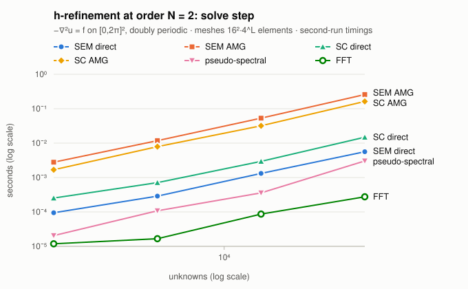
</picture>

<picture>
  <source media="(prefers-color-scheme: dark)" srcset="assets/ppb_highres/ppb_hrefine_cost_N2-dark.svg">
  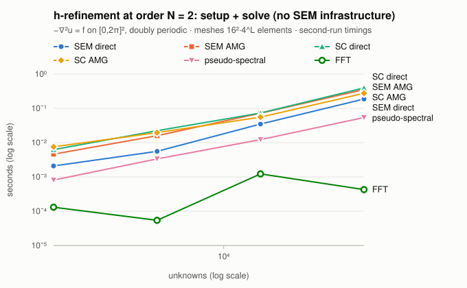
</picture>

<picture>
  <source media="(prefers-color-scheme: dark)" srcset="assets/ppb_highres/ppb_hrefine_total_N2-dark.svg">
  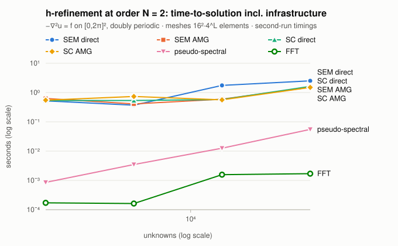
</picture>

**SEM order N = 3**

<picture>
  <source media="(prefers-color-scheme: dark)" srcset="assets/ppb_highres/ppb_hrefine_solve_N3-dark.svg">
  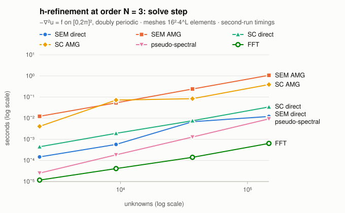
</picture>

<picture>
  <source media="(prefers-color-scheme: dark)" srcset="assets/ppb_highres/ppb_hrefine_cost_N3-dark.svg">
  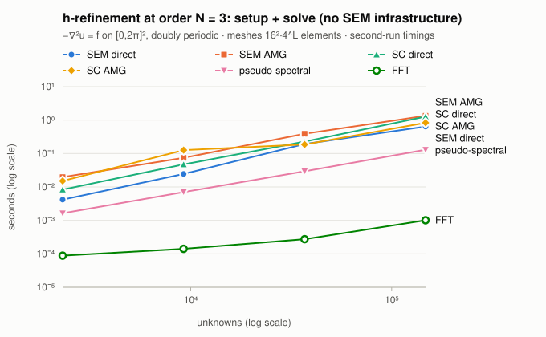
</picture>

<picture>
  <source media="(prefers-color-scheme: dark)" srcset="assets/ppb_highres/ppb_hrefine_total_N3-dark.svg">
  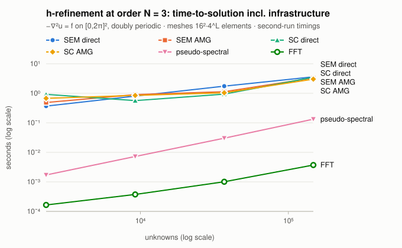
</picture>

**SEM order N = 4**

<picture>
  <source media="(prefers-color-scheme: dark)" srcset="assets/ppb_highres/ppb_hrefine_solve_N4-dark.svg">
  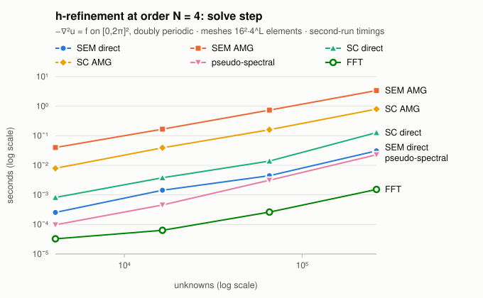
</picture>

<picture>
  <source media="(prefers-color-scheme: dark)" srcset="assets/ppb_highres/ppb_hrefine_cost_N4-dark.svg">
  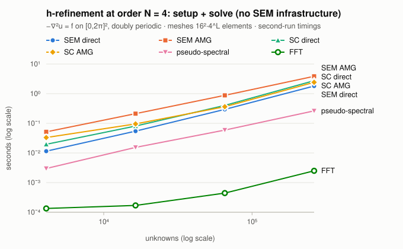
</picture>

<picture>
  <source media="(prefers-color-scheme: dark)" srcset="assets/ppb_highres/ppb_hrefine_total_N4-dark.svg">
  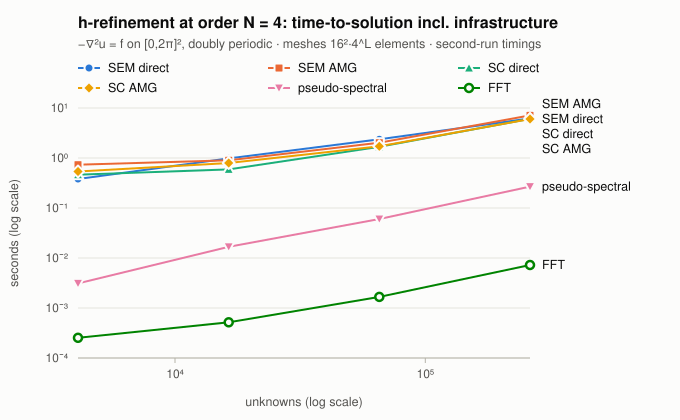
</picture>

**SEM order N = 5**

<picture>
  <source media="(prefers-color-scheme: dark)" srcset="assets/ppb_highres/ppb_hrefine_solve_N5-dark.svg">
  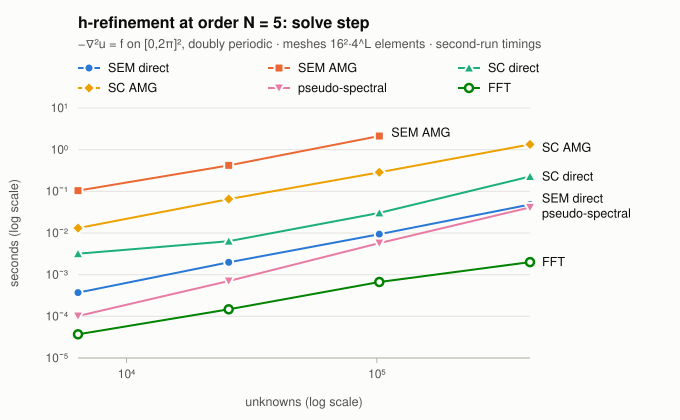
</picture>

<picture>
  <source media="(prefers-color-scheme: dark)" srcset="assets/ppb_highres/ppb_hrefine_cost_N5-dark.svg">
  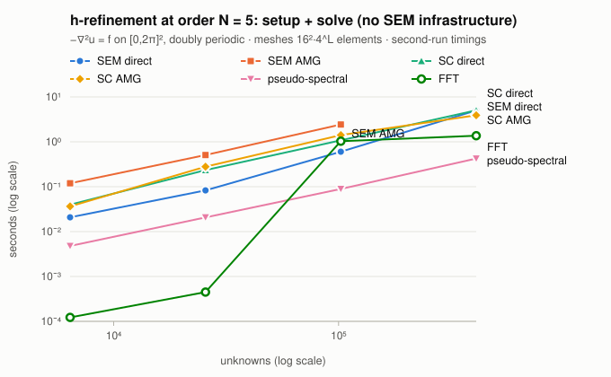
</picture>

<picture>
  <source media="(prefers-color-scheme: dark)" srcset="assets/ppb_highres/ppb_hrefine_total_N5-dark.svg">
  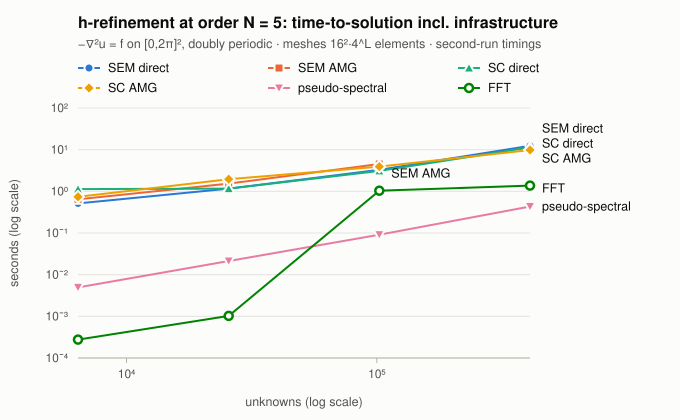
</picture>

**SEM order N = 6**

<picture>
  <source media="(prefers-color-scheme: dark)" srcset="assets/ppb_highres/ppb_hrefine_solve_N6-dark.svg">
  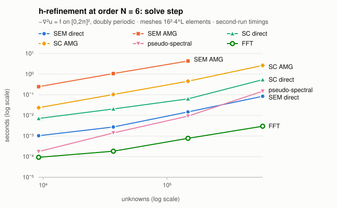
</picture>

<picture>
  <source media="(prefers-color-scheme: dark)" srcset="assets/ppb_highres/ppb_hrefine_cost_N6-dark.svg">
  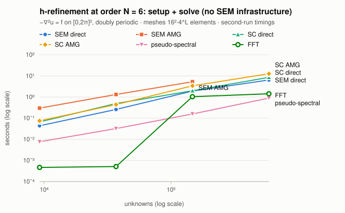
</picture>

<picture>
  <source media="(prefers-color-scheme: dark)" srcset="assets/ppb_highres/ppb_hrefine_total_N6-dark.svg">
  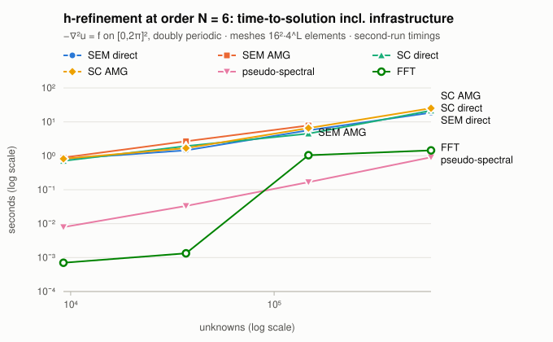
</picture>

**SEM order N = 7**

<picture>
  <source media="(prefers-color-scheme: dark)" srcset="assets/ppb_highres/ppb_hrefine_solve_N7-dark.svg">
  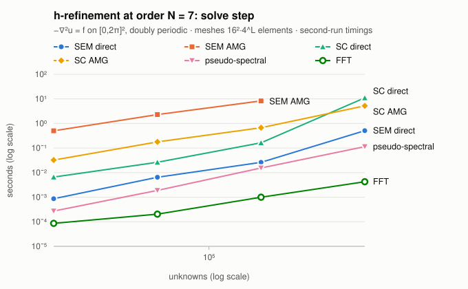
</picture>

<picture>
  <source media="(prefers-color-scheme: dark)" srcset="assets/ppb_highres/ppb_hrefine_cost_N7-dark.svg">
  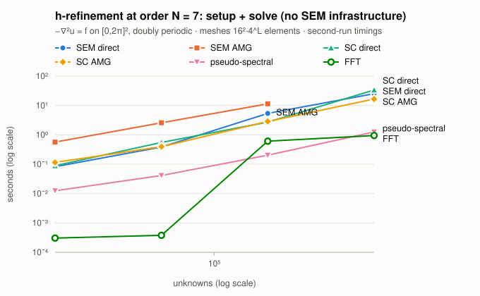
</picture>

<picture>
  <source media="(prefers-color-scheme: dark)" srcset="assets/ppb_highres/ppb_hrefine_total_N7-dark.svg">
  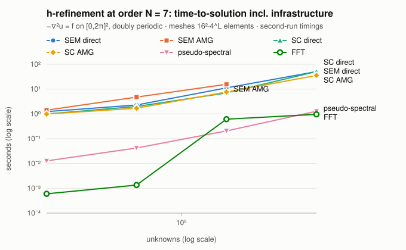
</picture>

**SEM order N = 8**

<picture>
  <source media="(prefers-color-scheme: dark)" srcset="assets/ppb_highres/ppb_hrefine_solve_N8-dark.svg">
  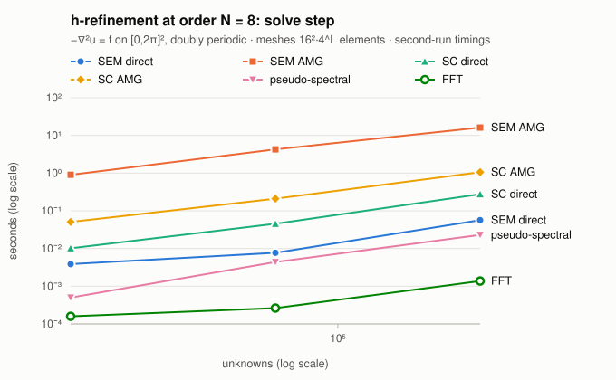
</picture>

<picture>
  <source media="(prefers-color-scheme: dark)" srcset="assets/ppb_highres/ppb_hrefine_cost_N8-dark.svg">
  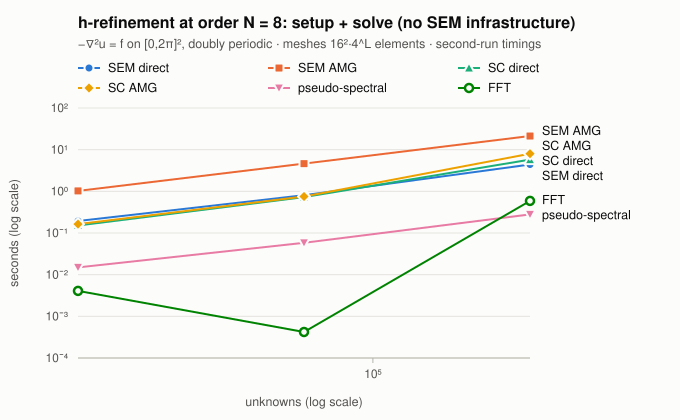
</picture>

<picture>
  <source media="(prefers-color-scheme: dark)" srcset="assets/ppb_highres/ppb_hrefine_total_N8-dark.svg">
  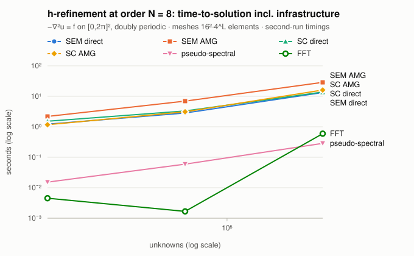
</picture>

#### Error and time at each mesh level

**Level 0: 16×16 elements**

<picture>
  <source media="(prefers-color-scheme: dark)" srcset="assets/ppb_highres/ppb_error_vs_order_L0-dark.svg">
  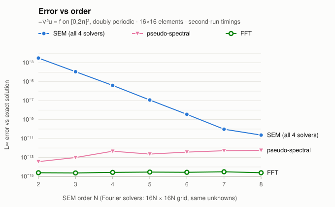
</picture>

<picture>
  <source media="(prefers-color-scheme: dark)" srcset="assets/ppb_highres/ppb_error_vs_dofs_L0-dark.svg">
  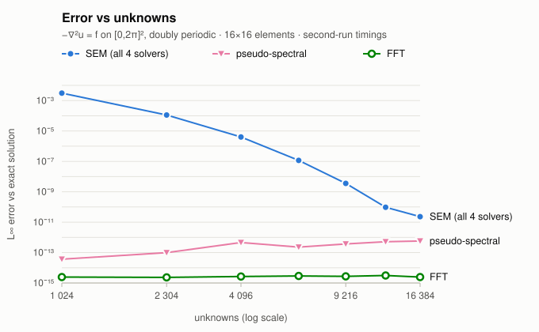
</picture>

<picture>
  <source media="(prefers-color-scheme: dark)" srcset="assets/ppb_highres/ppb_error_vs_solve_time_L0-dark.svg">
  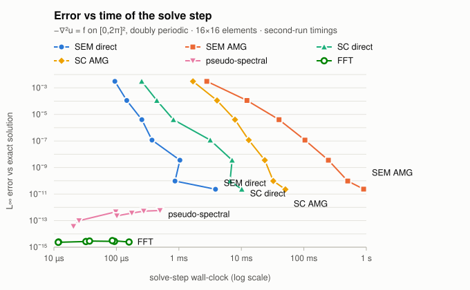
</picture>

<picture>
  <source media="(prefers-color-scheme: dark)" srcset="assets/ppb_highres/ppb_error_vs_total_time_L0-dark.svg">
  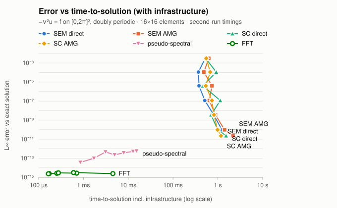
</picture>

**Level 1: 32×32 elements**

<picture>
  <source media="(prefers-color-scheme: dark)" srcset="assets/ppb_highres/ppb_error_vs_order_L1-dark.svg">
  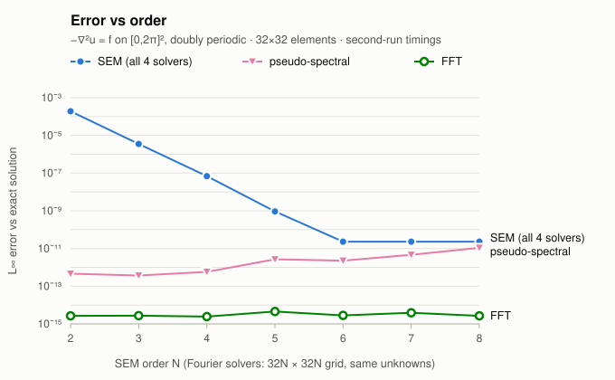
</picture>

<picture>
  <source media="(prefers-color-scheme: dark)" srcset="assets/ppb_highres/ppb_error_vs_dofs_L1-dark.svg">
  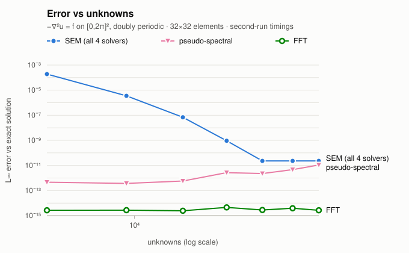
</picture>

<picture>
  <source media="(prefers-color-scheme: dark)" srcset="assets/ppb_highres/ppb_error_vs_solve_time_L1-dark.svg">
  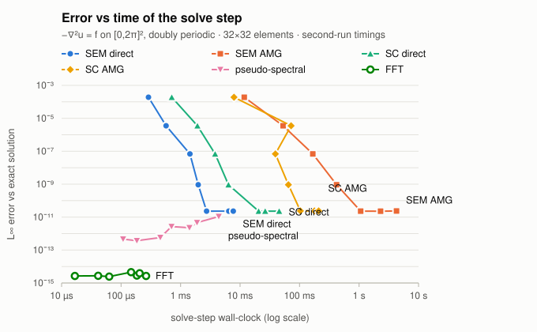
</picture>

<picture>
  <source media="(prefers-color-scheme: dark)" srcset="assets/ppb_highres/ppb_error_vs_total_time_L1-dark.svg">
  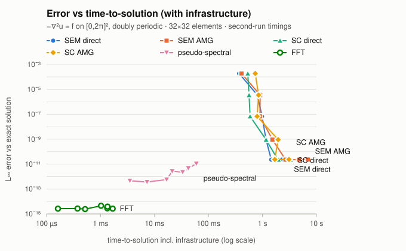
</picture>

**Level 2: 64×64 elements**

<picture>
  <source media="(prefers-color-scheme: dark)" srcset="assets/ppb_highres/ppb_error_vs_order_L2-dark.svg">
  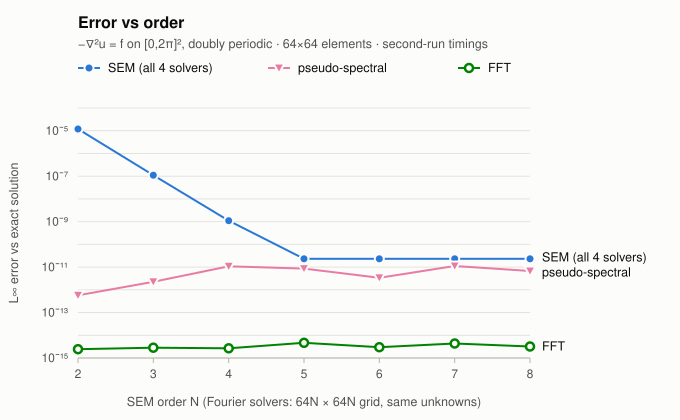
</picture>

<picture>
  <source media="(prefers-color-scheme: dark)" srcset="assets/ppb_highres/ppb_error_vs_dofs_L2-dark.svg">
  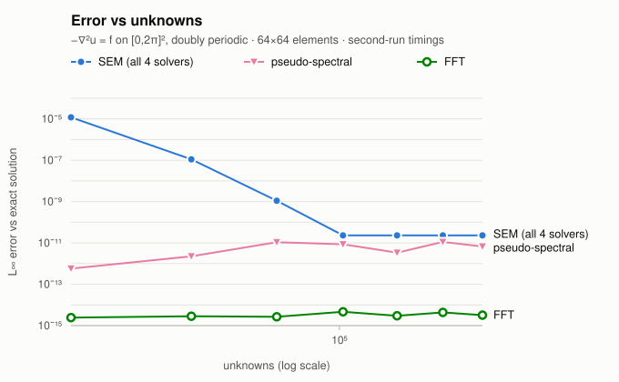
</picture>

<picture>
  <source media="(prefers-color-scheme: dark)" srcset="assets/ppb_highres/ppb_error_vs_solve_time_L2-dark.svg">
  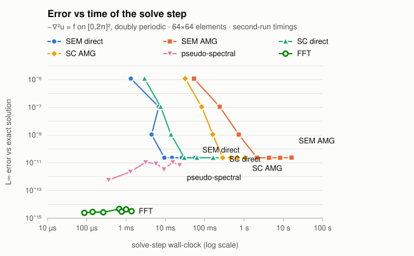
</picture>

<picture>
  <source media="(prefers-color-scheme: dark)" srcset="assets/ppb_highres/ppb_error_vs_total_time_L2-dark.svg">
  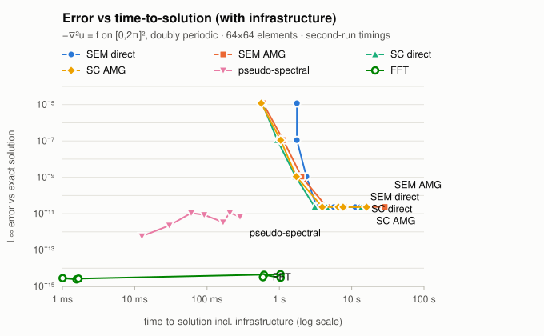
</picture>

**Level 3: 128×128 elements**

<picture>
  <source media="(prefers-color-scheme: dark)" srcset="assets/ppb_highres/ppb_error_vs_order_L3-dark.svg">
  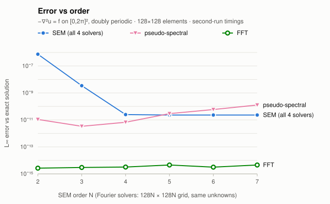
</picture>

<picture>
  <source media="(prefers-color-scheme: dark)" srcset="assets/ppb_highres/ppb_error_vs_dofs_L3-dark.svg">
  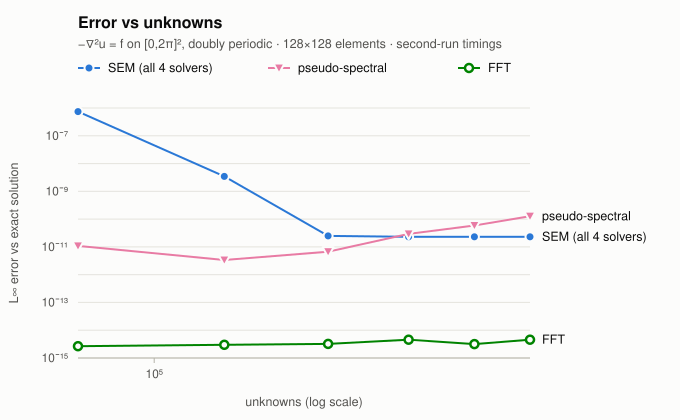
</picture>

<picture>
  <source media="(prefers-color-scheme: dark)" srcset="assets/ppb_highres/ppb_error_vs_solve_time_L3-dark.svg">
  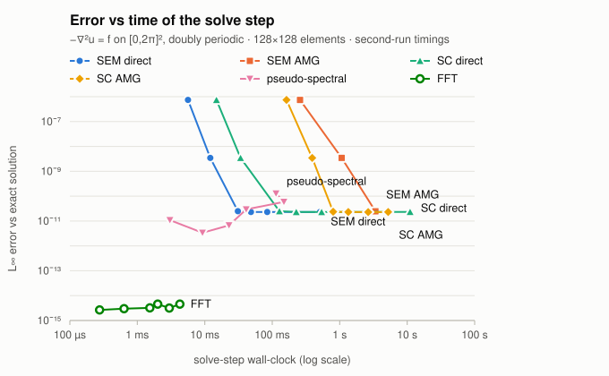
</picture>

<picture>
  <source media="(prefers-color-scheme: dark)" srcset="assets/ppb_highres/ppb_error_vs_total_time_L3-dark.svg">
  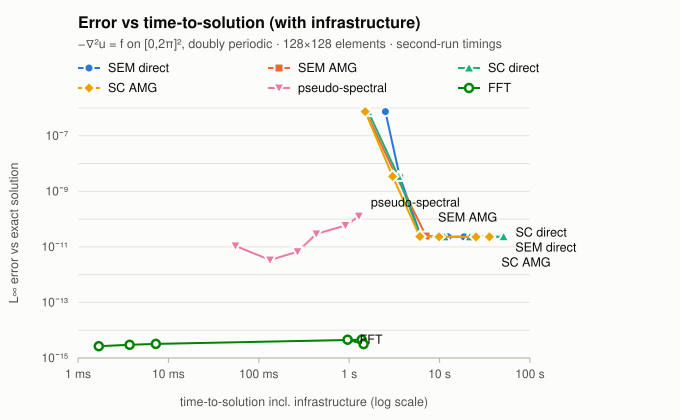
</picture>
<!-- ppb_highres:end -->

## Laguerre semi-infinite element test suite
This section contains instructions to run all of the test cases presented in

```
@article{tissaoui2024,
  author = {Y. Tissaoui and J. F. Kelly and S. Marras}
  title = {Efficient Spectral Element Method for the Euler Equations on Unbounded Domains},
  volume ={487},
  pages={129080},
  year = {2024},
  journal = {App. Math. Comput.},
}
```

### Test 1: 1D wave equation with Laguerre semi-infinite element absorbing layers

The problem is defined in [`problems/CompEuler/wave1d_lag`](https://github.com/smarras79/Jexpresso/tree/master/problems/equations/CompEuler/wave1d_lag) and by default output will be written to `output/CompEuler/wave1d_lag`. To solve this problem run the following commands from the Julia command line:

```julia
using Jexpresso
Jexpresso.run_case("CompEuler", "wave1d_lag")
```


### Test 2: 1D wave train for linearized shallow water equations

The problem is defined in [`problems/equations/AdvDiff/Wave_Train`](https://github.com/smarras79/Jexpresso/tree/master/problems/equations/AdvDiff/Wave_Train) and by default output will be written to `output/AdvDiff/Wave_Train`. To solve this problem run the following commands from the Julia command line:

```julia
using Jexpresso
Jexpresso.run_case("AdvDiff", "Wave_Train")
```


### Test 3: 2D advection-diffusion equation

The problem is defined in [`problems/equations/AdvDiff/2D_laguerre`](https://github.com/smarras79/Jexpresso/tree/master/problems/equations/AdvDiff/2d_Laguerre) and by default output will be written to `output/AdvDiff/2D_laguerre`. To solve this problem run the following commands from the Julia command line:

```julia
using Jexpresso
Jexpresso.run_case("AdvDiff", "2D_laguerre")
```


### Test 4: 2D Helmholtz equation

The problem is defined in [`problems/equations/Helmholtz/case1_laguerre`](https://github.com/smarras79/Jexpresso/tree/master/problems/equations/Helmholtz/case1_laguerre) and by default output will be written to `output/Helmholtz/case1_laguerre`. To solve this problem run the following commands from the Julia command line:

```julia
using Jexpresso
Jexpresso.run_case("Helmholtz", "case1_laguerre")
```


## Rising thermal bubble with semi-infinite Laguerre elements for outflows

The problem is defined in [`problems/equations/CompEuler/theta_laguerre`](https://github.com/smarras79/Jexpresso/tree/master/problems/equations/CompEuler/theta_laguerre) and by default output will be written to `output/CompEuler/theta_laguerre`. To solve this problem run the following commands from the Julia command line:

```julia
using Jexpresso
Jexpresso.run_case("CompEuler", "theta_laguerre")
```


## Hydrostatic linear mountain waves with semi-infinite Laguerre elements for outflows

The problem is defined in [`problems/equations/CompEuler/HSmount_Lag`](https://github.com/smarras79/Jexpresso/tree/master/problems/equations/CompEuler/HSmount_Lag) and by default output will be written to `output/CompEuler/HSmount_Lag`. To solve this problem run the following commands from the Julia command line:

```bash      
using Jexpresso
Jexpresso.run_case("CompEuler", "HSmount_Lag")
```


## Non-hydrostatic mountain waves: comparison against WRF


