# 

| **Documentation** |
|:------------ |
 [](https://smarras79.github.io/Jexpresso/dev/) [](https://smarras79.github.io/Jexpresso/dev/) |
|**Build Status** |
| [](https://github.com/smarras79/Jexpresso/actions/workflows/CI.yml?query=branch%3Amaster) [](https://github.com/smarras79/Jexpresso/actions/workflows/Documentation.yml?query=branch%3Amaster)
| **Contacts**  |
| [](mailto:smarras@njit.edu) |
| [](mailto:tissaoui@wisc.edu) |
| [](mailto:hang.wang@njit.edu) |
| **Citation** |
| [](https://doi.org/10.48550/arXiv.2401.05624) |

# JEXPRESSO:
A CPU and GPU research software for the numerical solution of a system of arbitrary conservation laws using **continuous spectral elements** and finite differences in **1D, 2D, 3D**. DISCLAIMER: this will always be WIP! Contact us to join the team of developers!

Suggested Julia version: 1.11.9

# Table of Contents

- [Installation](#installation)
- [Equations](#equations)
  1. [1D wave equation](#1-1d-wave-equation)
  2. [1D shallow water](#2-1d-shallow-water)
  3. [2D Helmholtz](#3-2d-helmholtz)
  4. [2D scalar advection-diffusion](#4-2d-scalar-advection-diffusion)
  5. [2D Euler equations of compressible flows with gravity and passive chemicals](#5-2d-euler-equations-of-compressible-flows-with-gravity-and-passive-chemicals)
  6. [3D Euler equations of compressible flows with gravity](#6-3d-euler-equations-of-compressible-flows-with-gravity)
- [Showcase](#turbulent-abl)
  - [Turbulent ABL](#turbulent-abl)
  - [Shallow cumuli](#shallow-cumuli)
- [Examples available in this branch](#examples-available-in-this-branch)
  - [1D shock tube with dynamic SGS (DynSGS) for shock capturing](#1d-shock-tube-with-dynamic-sgs-dynsgs-for-shock-capturing)
  - [1D acoustic wave](#1d-acoustic-wave)
  - [Flow at Mach 3 with forward-facing step](#flow-at-mach-3-with-forward-facing-step)
  - [Kelvin-Helmholtz instability](#kelvin-helmholtz-instability)
  - [Solid elasticicy](#Solid-elasticity)
  - [MHD: magnetized Kelvin-Helmholtz instability](#magneto-hydrodynamics-mhd-magnetized-kelvin-helmholtz-instability)
  - [MHD: Orszag-Tang vortex](#magneto-hydrodynamics-mhd-orszag-tang-vortex)
  - [Cloud simulation: shallow cumuli with BOMEX conditions](#cloud-simulation-shallow-cumuli-with-bomex-conditions)
  - [Shallow water on a spherical shell](#shallow-water-on-a-spherical-shell)
  - [2D Euler equations with buoyancy and two passive tracers](#2d-euler-equations-with-buoyancy-and-two-passive-tracers)
  - [3D Euler equations with buoyancy](#3d-euler-equations-with-buoyancy)
  - [Laguerre semi-infinite element test suite](#laguerre-semi-infinite-element-test-suite)
    - [Test 1: 1D wave equation with Laguerre absorbing layers](#test-1-1d-wave-equation-with-laguerre-semi-infinite-element-absorbing-layers)
    - [Test 2: 1D wave train for linearized shallow water equations](#test-2-1d-wave-train-for-linearized-shallow-water-equations)
    - [Test 3: 2D advection-diffusion equation](#test-3-2d-advection-diffusion-equation)
    - [Test 4: 2D Helmholtz equation](#test-4-2d-helmholtz-equation)
  - [Rising thermal bubble with semi-infinite Laguerre elements for outflows](#rising-thermal-bubble-with-semi-infinite-laguerre-elements-for-outflows)
  - [Hydrostatic linear mountain waves with semi-infinite Laguerre elements for outflows](#hydrostatic-linear-mountain-waves-with-semi-infinite-laguerre-elements-for-outflows)
  - [Non-hydrostatic mountain waves: comparison against WRF](#non-hydrostatic-mountain-waves-comparison-against-wrf)

# Installation:
Follow the instructins in [INSTALL.md](INSTALL.md)

Run into trouble? Check the [FAQ.md](FAQ.md) for common installation and run errors.

If you use Jexpresso please drop us a line to let us know. We'd like to add a link to your paper or work on this page.

Please cite Jexpresso using:

```
@article{tissaoui2024,
  author = {Y. Tissaoui and J. F. Kelly and S. Marras}
  title = {Efficient Spectral Element Method for the Euler Equations on Unbounded Domains},
  volume ={487},
  pages={129080},
  year = {2024},
  journal = {App. Math. Comput.},
}

@inproceedings{marrasJexpresso,
  author    = {S. Marras and Y. Tissaoui and H. Wang and S. Stechmann}
  title     = {Jexpresso V0.1.0: a Julia-language, user-friendly, multi-physics parallel solver for the solution of conservation laws on CPUs and GPUs},
  booktitle = {Proceedings of the 36th Parallel CFD international conference 2025},
  year      = {2025},
  address   = {Merida, Yucatan, Mexico},
  month     = {November},
  organization = {UNAM},
}
```

# Equations:
Jexpresso uses arbitrarily high-order (3rd and above) **continuous spectral elements** to solve

$$\delta\frac{\partial \bf q}{\partial t} + \sum_{i=1}^{nd}\nabla\cdot{{\bf F}_i({\bf q})} = \mu\nabla^2{\bf q} + {\bf S}({\bf q}) + ~{\rm b.c.}$$

where $\delta = 0,1$ simply indicates time-independent equations the vectors ${\bf q}$, ${\bf F}$, and ${\bf S}$ are problem-dependent as shown below,
and are taken to be zero vectors of the appropriate size when not explicitly stated otherwise.

The Julia package [DifferentialEquations.jl](https://docs.sciml.ai/DiffEqDocs/stable/) is used for time discretization and stepping.

In order, we provide tests and results for the following equations:


### 1. 1D wave equation

$${\bf q}=\begin{bmatrix}
u \\
v
\end{bmatrix}\quad {\bf F}=\begin{bmatrix}
v\\
u
\end{bmatrix}$$

### 2. 1D shallow water

$${\bf q}=\begin{bmatrix}
h \\
u
\end{bmatrix}\quad {\bf F}=\begin{bmatrix}
Uh + Hu\\
gh + Uu
\end{bmatrix},$$

where $H$ and $U$ are a reference height and velocity, respectively.

### 3. 2D Helmholtz

$${\bf S}=\begin{bmatrix}
\alpha^2 u + f(x,z)
\end{bmatrix}\quad \mu\nabla^2{\bf q}=\mu\begin{bmatrix}
u_{xx} + u_{zz}
\end{bmatrix},$$

for a constant value of $\alpha$ and $\mu$, which are case-dependent.

### 4. 2D scalar advection-diffusion

$${\bf q}=\begin{bmatrix}
q\\
\end{bmatrix}\quad {\bf F}=\begin{bmatrix}
qu\\
\end{bmatrix}\quad {\bf F}=\begin{bmatrix}
qv\\
\end{bmatrix}\quad \mu\nabla^2{\bf q}=\mu\begin{bmatrix}
q_{xx} + q_{zz}
\end{bmatrix},$$

### 5. 2D Euler equations of compressible flows with gravity and passive chemicals

With $N$ passive chemicals $c_i, \forall i=1,...,N$:

$${\bf q}=\begin{bmatrix}
\rho \\
\rho u\\
\rho v\\
\rho \theta\\
\rho c1\\
...\\
\rho cN
\end{bmatrix}\quad {\bf F1}=\begin{bmatrix}
\rho u\\
\rho u^2 + p\\
\rho u v\\
\rho u \theta\\
\rho u c1\\
...\\
\rho u cN
\end{bmatrix}\quad {\bf F2}=\begin{bmatrix}
\rho v\\
\rho v u\\
\rho v^2 + p\\
\rho v \theta\\
\rho v c1\\
...\\
\rho v cN
\end{bmatrix}\quad {\bf S}=\begin{bmatrix}
0\\
0\\
-\rho g\\
0\\
0\\
...\\
0
\end{bmatrix}\quad \mu\nabla^2{\bf q}=\mu\begin{bmatrix}
0\\
u_{xx} + u_{zz}\\
v_{xx} + v_{zz}\\
\theta_{xx} + \theta_{zz}\\
c1_{xx} + c1_{zz}\\
...\\
cN_{xx} + cN_{zz}
\end{bmatrix}.$$

### 6. 3D Euler equations of compressible flows with gravity

$${\bf q}=\begin{bmatrix}
\rho \\
\rho u\\
\rho v\\
\rho w\\
\rho \theta\\
\end{bmatrix}\quad {\bf F}1=\begin{bmatrix}
\rho u\\
\rho u^2 + p\\
\rho u v\\
\rho u w\\
\rho u \theta\\
\end{bmatrix}\quad {\bf F}2=\begin{bmatrix}
\rho v\\
\rho v u\\
\rho v^2 + p\\
\rho v w\\
\rho v \theta\\
\end{bmatrix}\quad {\bf F3}=\begin{bmatrix}
\rho w\\
\rho w u\\
\rho w v\\
\rho w^2 + p\\
\rho w \theta\\
\end{bmatrix}\quad {\bf S}=\begin{bmatrix}
0\\
0\\
0\\
-\rho g\\
0\\
\end{bmatrix}\quad \mu\nabla^2{\bf q}=\mu\begin{bmatrix}
0\\
u_{xx} + u_{yy} + u_{zz}\\
v_{xx} + v_{yy} + v_{zz}\\
w_{xx} + w_{yy} + w_{zz}\\
\theta_{xx} + \theta_{yy} + \theta_{zz}\\
\end{bmatrix}.$$


If you are interested in contributing, please get in touch:
[Simone Marras](mailto:smarras@njit.edu), [Yassine Tissaoui](mailto:tissaoui@wisc.edu), [Hang Wang](mailto:hang.wang@njit.edu)

## Turbulent ABL:
Example of coarse simulation of the turbulent atmospheric boundary layer. Domain size: 10240m X 10240m X 3000m using 64x64x24 spectral elements of order 4.
Surface and SGS: Monin-Obukhov Similarity Theory model with Richardson-corrected Smagorinsky.


## Shallow cumuli:
Example of shallow cumuli simulations (right) for the type of Barbados clouds shown on the left: (picture taken from [P. Blossey webpage](https://www.atmos.washington.edu/~bloss/) from U. Washington)

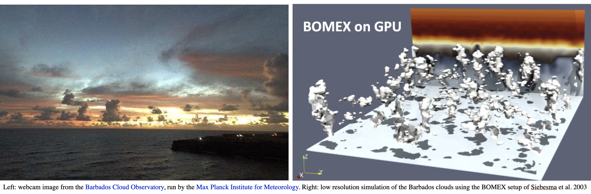

# Examples available in this branch:
Below are just a few pre-packaged examples available in Jexpresso.
To add your own new problem, see [ADD_A_NEW_TEST.md](ADD_A_NEW_TEST.md).


## 1D shock tube with dynamic SGS (DynSGS) for shock capturing:
Classical Sod's tube with shock and expansion.
The DynSGS SGS model by Marras et al. 2015 and later is used to capture the shock.

```julia
using Jexpresso
Jexpresso.run_case("CompEuler", "sod1d")
```

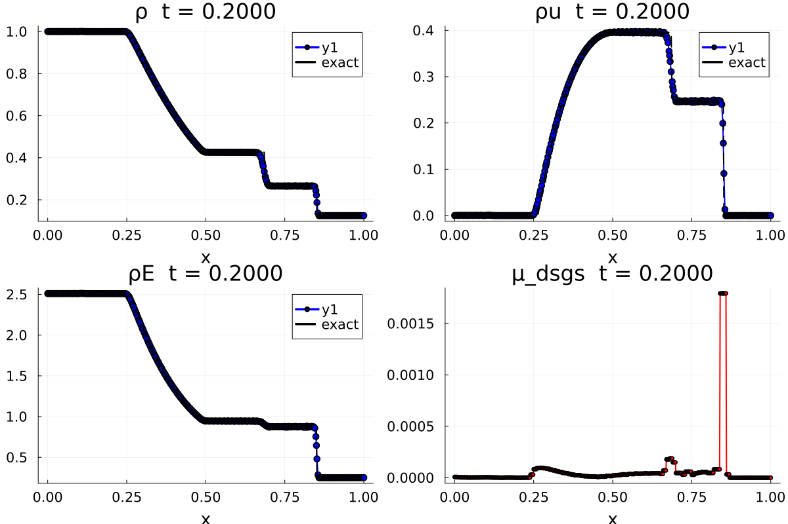

## 1D acoustic wave:
```julia
using Jexpresso
Jexpresso.run_case("CompEuler", "case1")
```

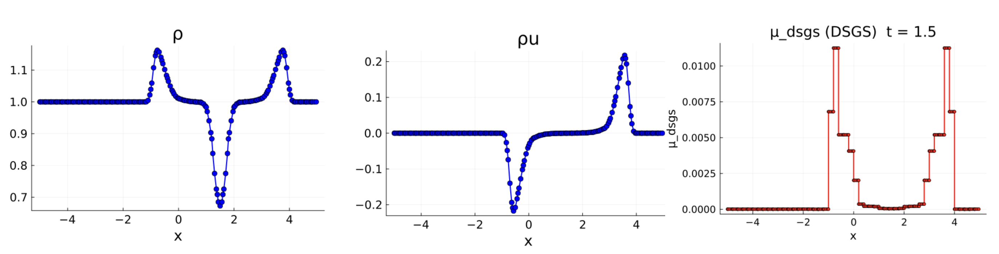

## Flow at Mach 3 with forward-facing step
Classical flow at Mach 3 with DynSGS shock capturing
```julia
using Jexpresso
Jexpresso.run_case("CompEuler", "ffs_step")
```

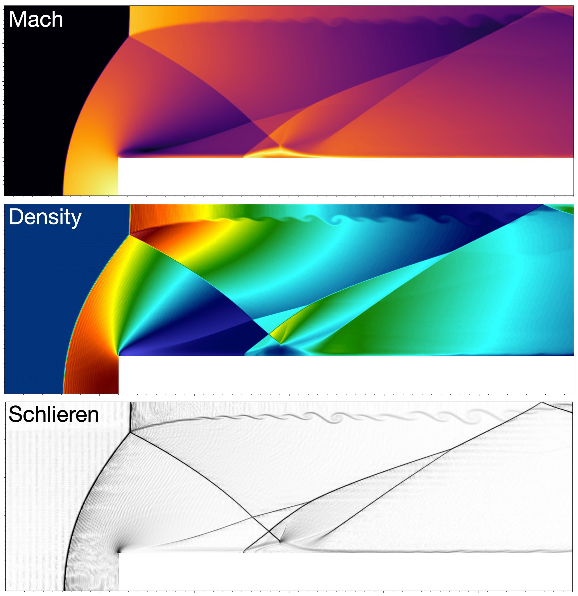

## Flow at Mach 3 with airfoil
Mach 3 flow over a (non-supersonic) airfoil with exact geometry (i.e. curved elements). DynSGS shock capturing.
```julia
using Jexpresso
Jexpresso.run_case("CompEuler", "naca64A210")
```

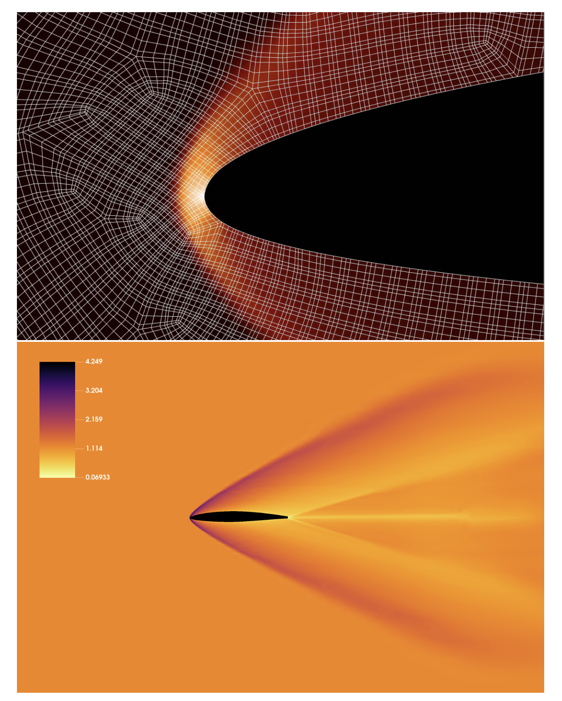


## Kelvin-Helmholtz instability
Classical shear-triggered instability test.

```julia
using Jexpresso
Jexpresso.run_case("CompEuler", "kelvinHelmholtzChan2022")
```

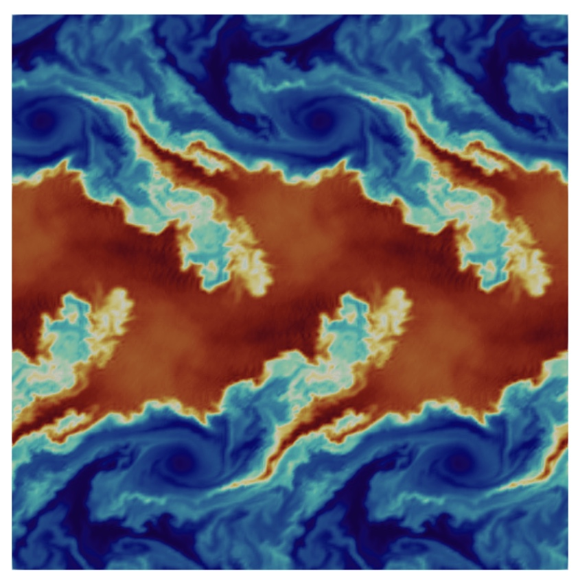


## Solid elasticity
Timoshenko's model of elasticity

```julia
using Jexpresso
Jexpresso.run_case("Elasticity", "beam2d")
```

https://github.com/user-attachments/assets/78872c85-e8b5-494f-b95a-4a94aeb5f07f

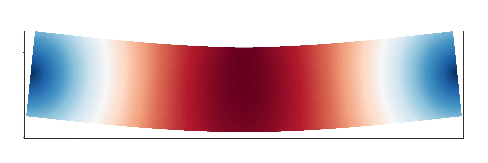


## Magneto-Hydrodynamics (MHD), magnetized Kelvin-Helmholtz instability:

The problem is defined in [`problems/equations/MHD/kelvinHelmholtzChan2022`](https://github.com/smarras79/Jexpresso/tree/master/problems/equations/MHD/kelvinHelmholtzChan2022).

```julia
using Jexpresso
Jexpresso.run_case("MHD", "kelvinHelmholtzChan2022")
```

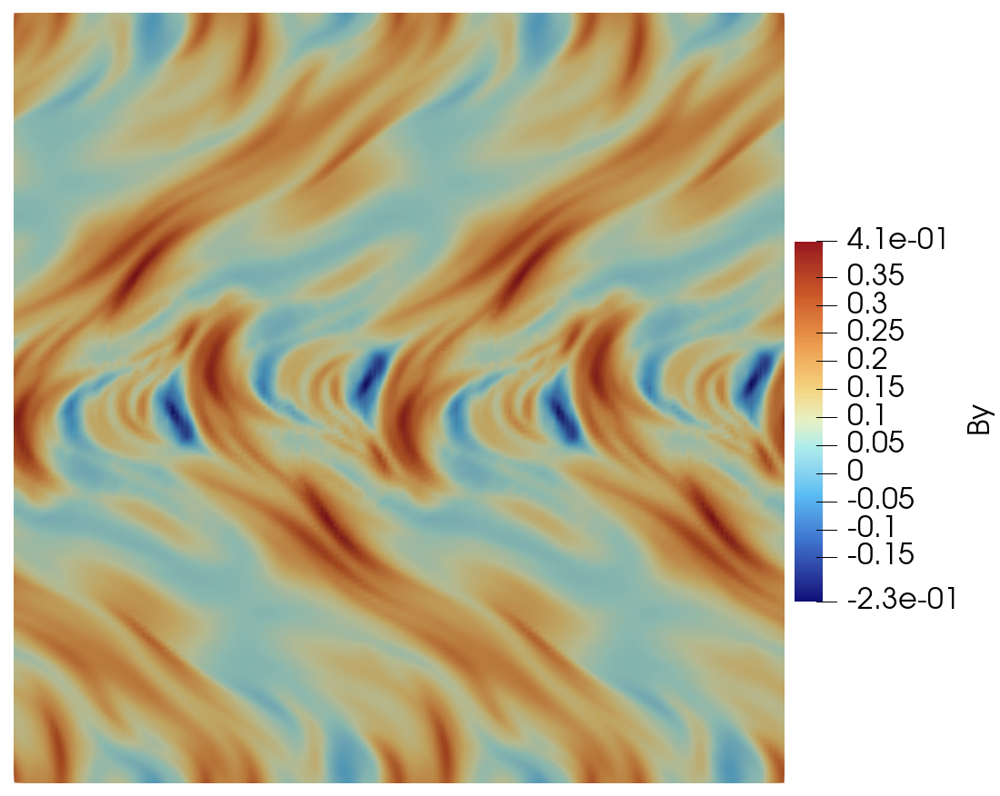

## Magneto-Hydrodynamics (MHD), Orszag-Tang vortex:

The classical 2D MHD benchmark, with the setup of Bormanis, Leon & Scheinker,
*Phys. Plasmas* **31**, 012101 (2024): doubly periodic unit square, γ = 5/3,
128×128 points, t ∈ [0, 1]. The problem is defined in
[`problems/equations/MHD/orszagTangBormanis2024`](https://github.com/smarras79/Jexpresso/tree/master/problems/equations/MHD/orszagTangBormanis2024)
(see its `README.md` and `EQUATIONS.md`).

```julia
using Jexpresso
Jexpresso.run_case("MHD", "orszagTangBormanis2024")
```

Stabilized with **DynSGS** — the residual-based, parameter-free dynamic SGS
model of Marras, Nazarov & Giraldo (see [DSGS.md](DSGS.md)).

Density at t = 0.7, 0.8, 0.9, 1.0, on the same 0.1-0.4 color scale as Fig. 3
of the reference:

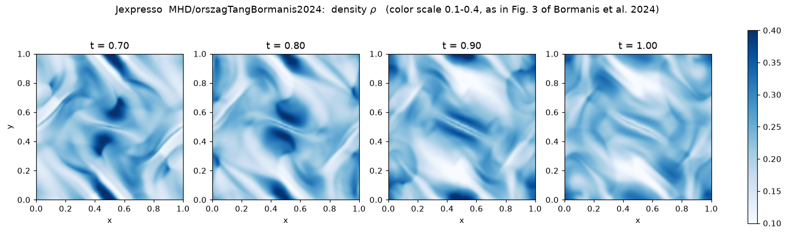

The y magnetic field at the same times, on a symmetric color scale shared by
the four panels:

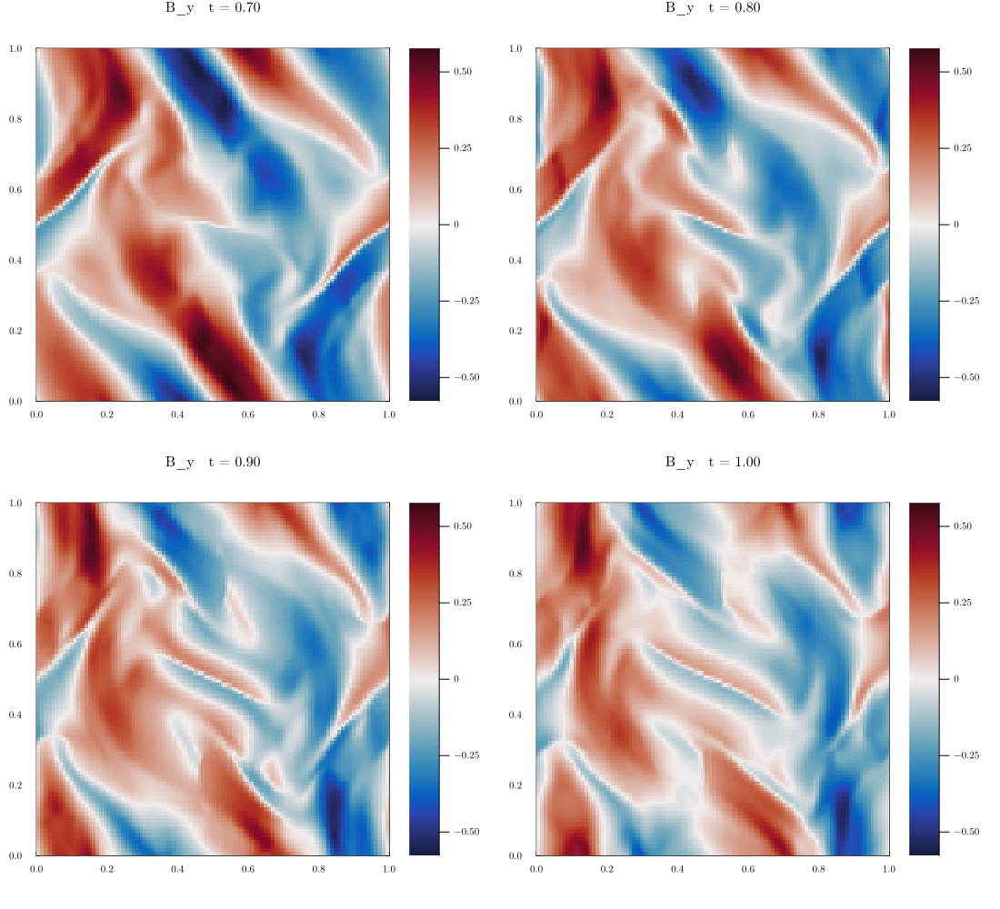

And the DynSGS eddy viscosity applied to the By equation (log scale), with By
isolines drawn on top. The coefficient spans 1.5–2.8 decades across the domain —
a global Smagorinsky constant spans none — and its rank correlation with |∇By|
is positive at every output time (0.26–0.64, strongest while the fronts are
steepening). See the
[case README](problems/MHD/orszagTangBormanis2024/README.md#figures) for the
measured table, which the plotting script reprints on every run.

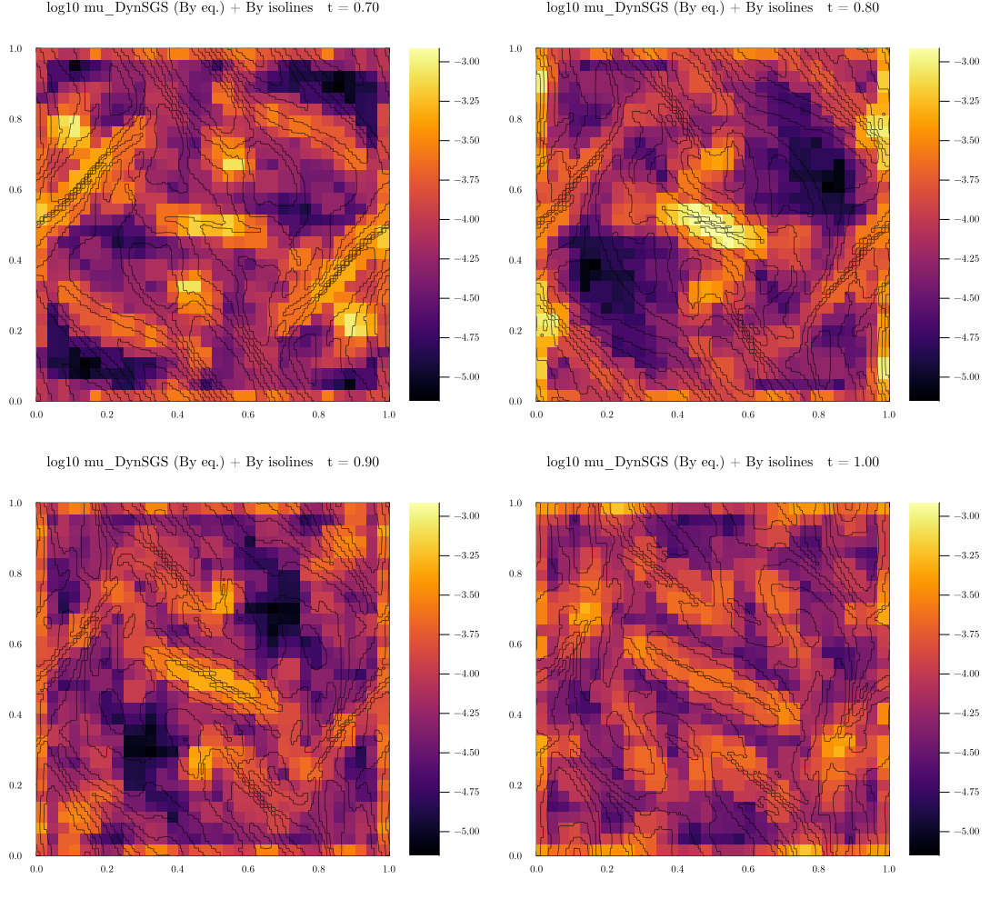

The solver writes VTK, not PNG. These three figures are rendered from a
finished run by `julia --project=. tools/plot_orszag_tang.jl`; see the
[case README](problems/MHD/orszagTangBormanis2024/README.md#figures).


## Cloud simulation: shallow cumuli with BOMEX conditions:

```julia
using Jexpresso
Jexpresso.run_case("CompEuler", "3d_bomex")
```
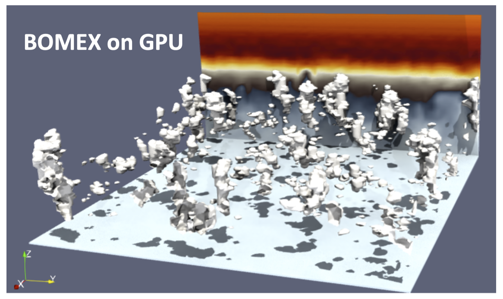

## Shallow water on a spherical shell
Benchmark: classical Galewki and Polvani's barotropic jet
```julia
using Jexpresso
Jexpresso.run_case("ShallowWater", "SWsphere")
```
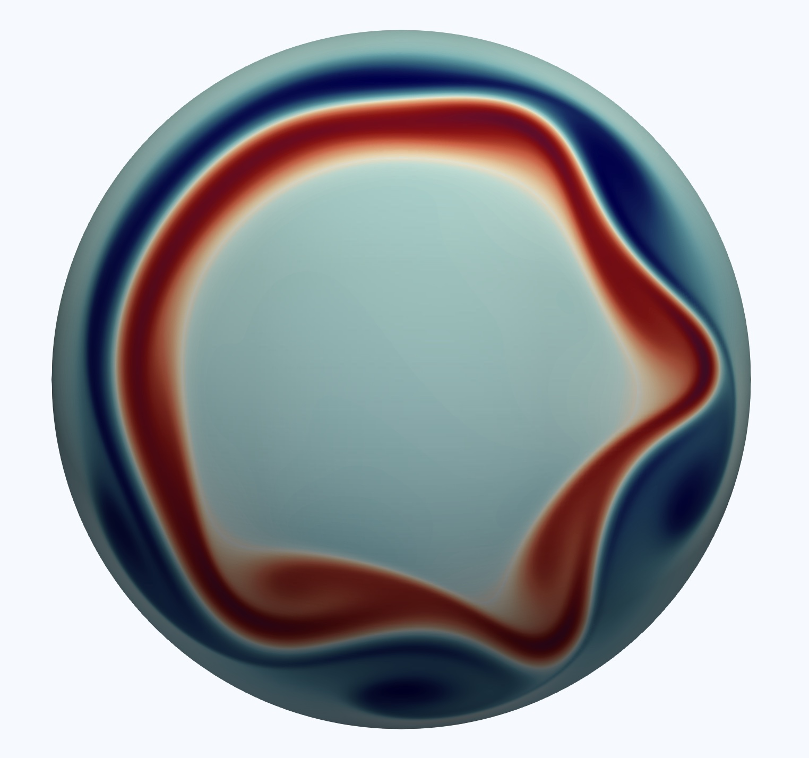


## 2D Euler equations with buoyancy and two passive tracers
The problem is defined in `problems/equations/CompEuler/thetaTracers`. To run it you would do the following:
```julia
using Jexpresso
Jexpresso.run_case("CompEuler", "thetaTracers")
```

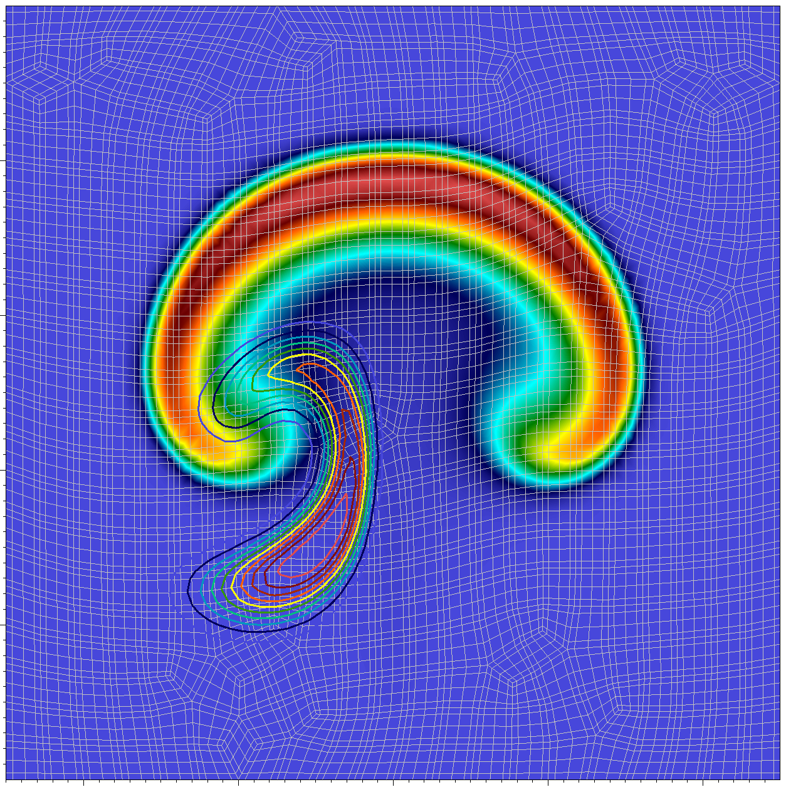


## 3D Euler equations with buoyancy
The problem is defined in `problems/equations/CompEuler/3d`. To run it you would do the following:
```julia
using Jexpresso
Jexpresso.run_case("CompEuler", "3d")
```

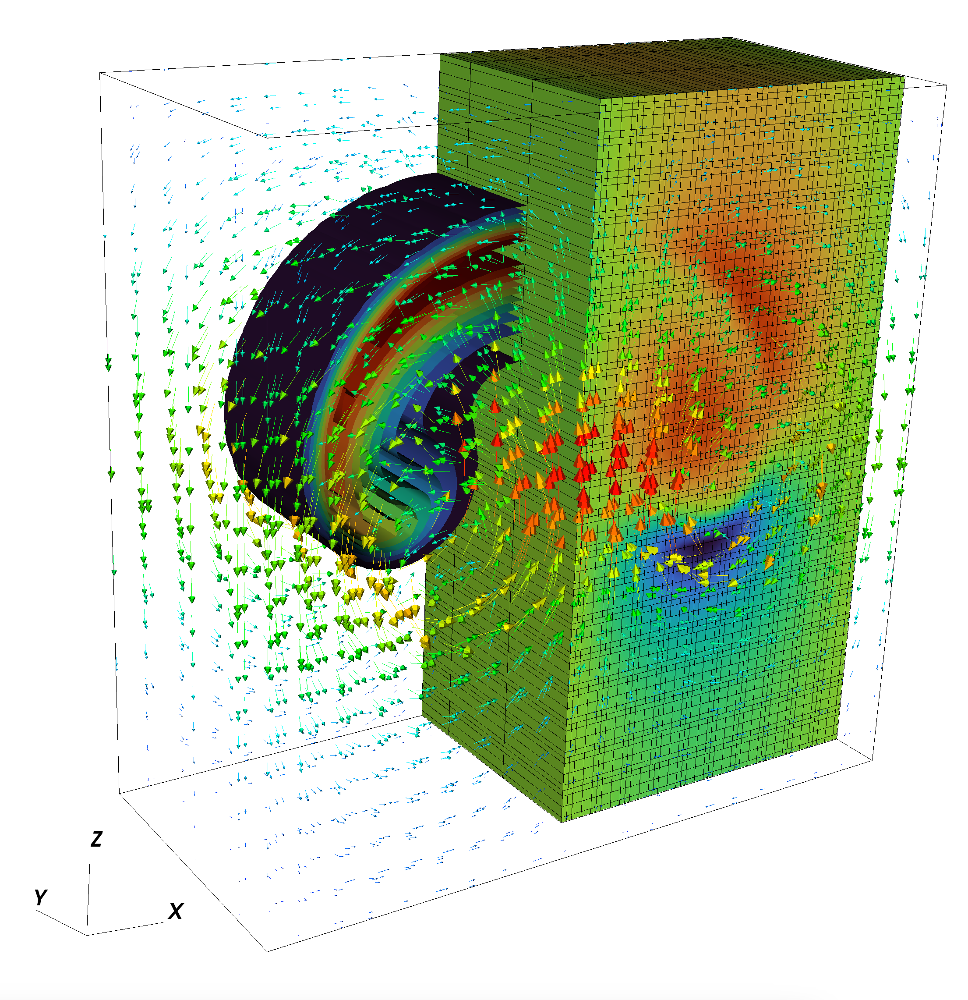

## Laguerre semi-infinite element test suite
This section contains instructions to run all of the test cases presented in

```
@article{tissaoui2024,
  author = {Y. Tissaoui and J. F. Kelly and S. Marras}
  title = {Efficient Spectral Element Method for the Euler Equations on Unbounded Domains},
  volume ={487},
  pages={129080},
  year = {2024},
  journal = {App. Math. Comput.},
}
```

### Test 1: 1D wave equation with Laguerre semi-infinite element absorbing layers

The problem is defined in [`problems/CompEuler/wave1d_lag`](https://github.com/smarras79/Jexpresso/tree/master/problems/equations/CompEuler/wave1d_lag) and by default output will be written to `output/CompEuler/wave1d_lag`. To solve this problem run the following commands from the Julia command line:

```julia
using Jexpresso
Jexpresso.run_case("CompEuler", "wave1d_lag")
```

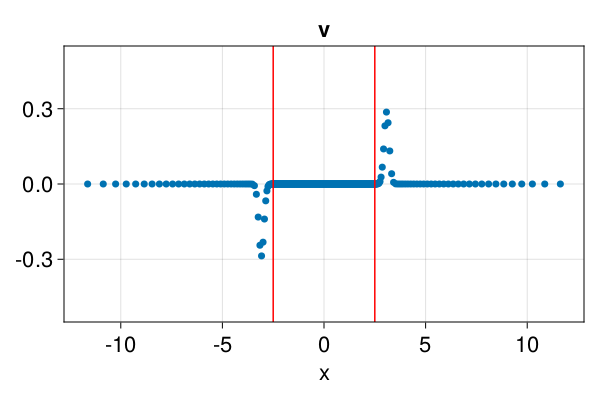

### Test 2: 1D wave train for linearized shallow water equations

The problem is defined in [`problems/equations/AdvDiff/Wave_Train`](https://github.com/smarras79/Jexpresso/tree/master/problems/equations/AdvDiff/Wave_Train) and by default output will be written to `output/AdvDiff/Wave_Train`. To solve this problem run the following commands from the Julia command line:

```julia
using Jexpresso
Jexpresso.run_case("AdvDiff", "Wave_Train")
```

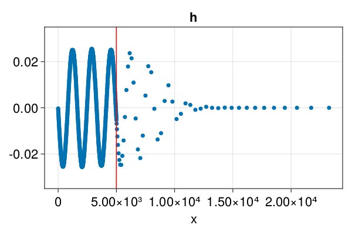


### Test 3: 2D advection-diffusion equation

The problem is defined in [`problems/equations/AdvDiff/2D_laguerre`](https://github.com/smarras79/Jexpresso/tree/master/problems/equations/AdvDiff/2d_Laguerre) and by default output will be written to `output/AdvDiff/2D_laguerre`. To solve this problem run the following commands from the Julia command line:

```julia
using Jexpresso
Jexpresso.run_case("AdvDiff", "2D_laguerre")
```

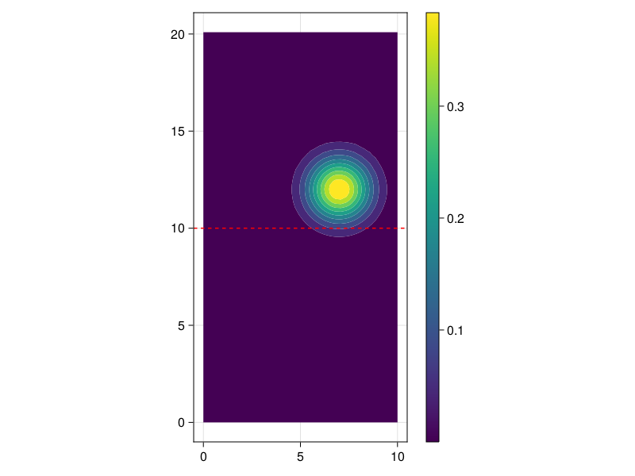

### Test 4: 2D Helmholtz equation

The problem is defined in [`problems/equations/Helmholtz/case1_laguerre`](https://github.com/smarras79/Jexpresso/tree/master/problems/equations/Helmholtz/case1_laguerre) and by default output will be written to `output/Helmholtz/case1_laguerre`. To solve this problem run the following commands from the Julia command line:

```julia
using Jexpresso
Jexpresso.run_case("Helmholtz", "case1_laguerre")
```

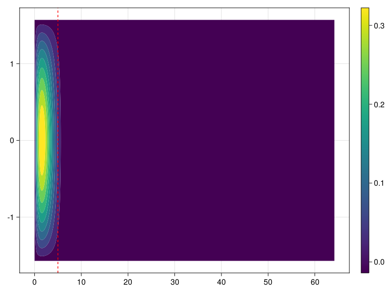

## Rising thermal bubble with semi-infinite Laguerre elements for outflows

The problem is defined in [`problems/equations/CompEuler/theta_laguerre`](https://github.com/smarras79/Jexpresso/tree/master/problems/equations/CompEuler/theta_laguerre) and by default output will be written to `output/CompEuler/theta_laguerre`. To solve this problem run the following commands from the Julia command line:

```julia
using Jexpresso
Jexpresso.run_case("CompEuler", "theta_laguerre")
```

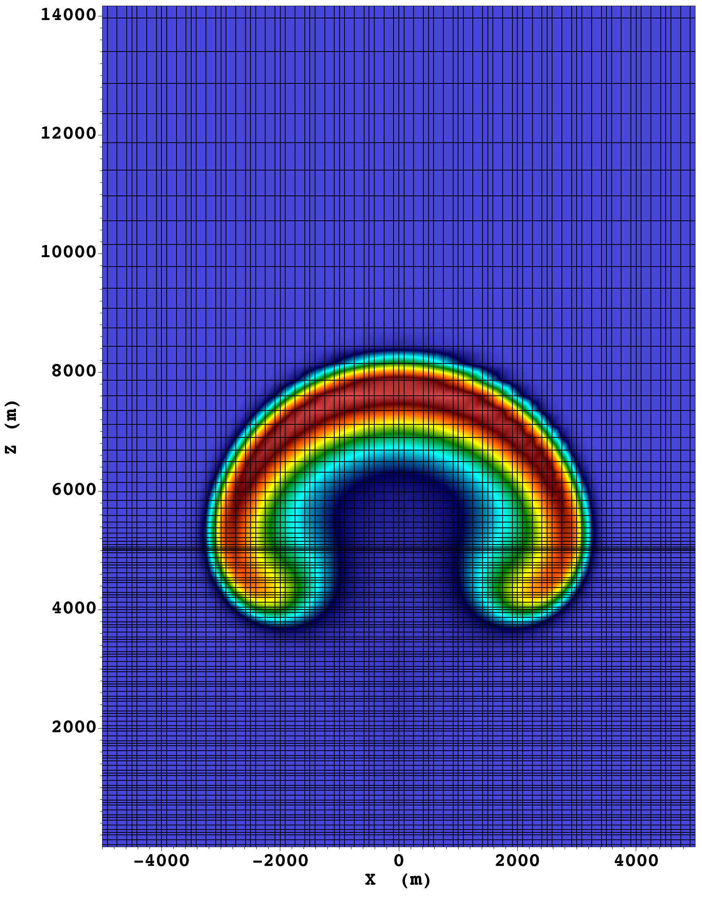


## Hydrostatic linear mountain waves with semi-infinite Laguerre elements for outflows

The problem is defined in [`problems/equations/CompEuler/HSmount_Lag`](https://github.com/smarras79/Jexpresso/tree/master/problems/equations/CompEuler/HSmount_Lag) and by default output will be written to `output/CompEuler/HSmount_Lag`. To solve this problem run the following commands from the Julia command line:

```bash      
using Jexpresso
Jexpresso.run_case("CompEuler", "HSmount_Lag")
```

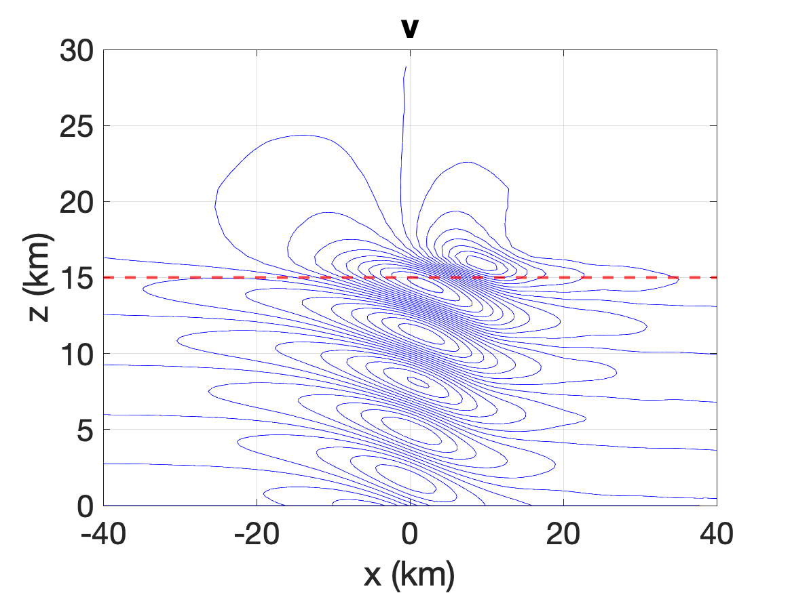

## Non-hydrostatic mountain waves: comparison against WRF

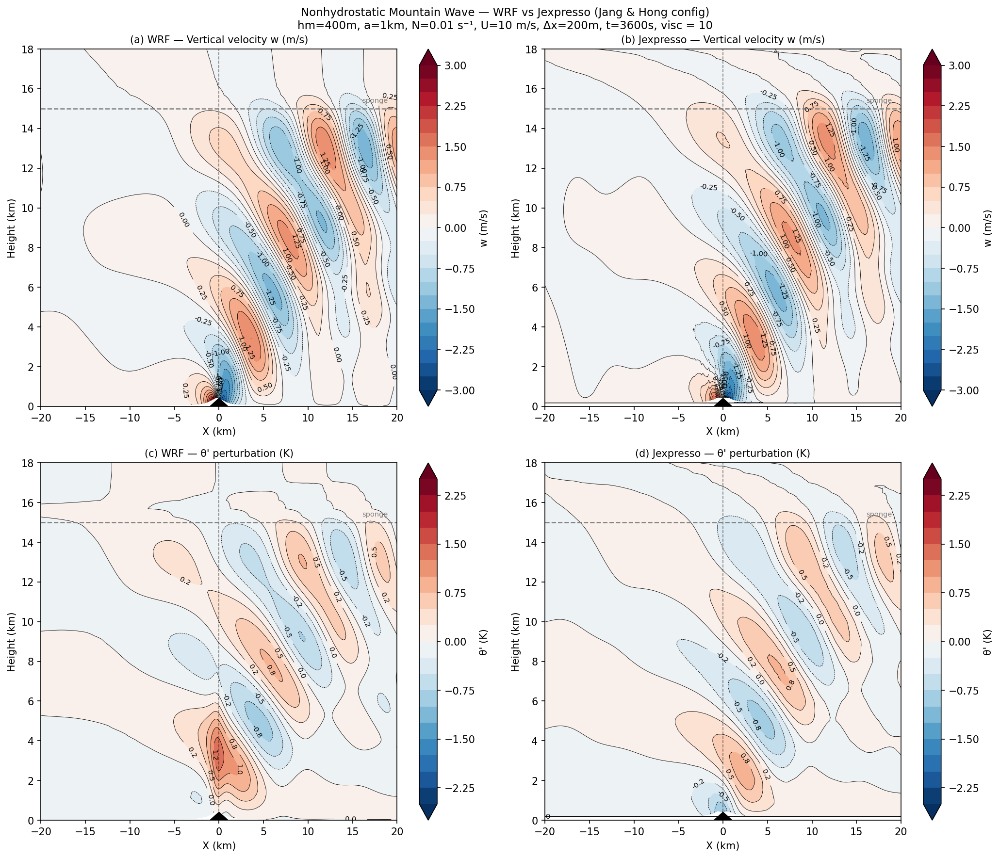
