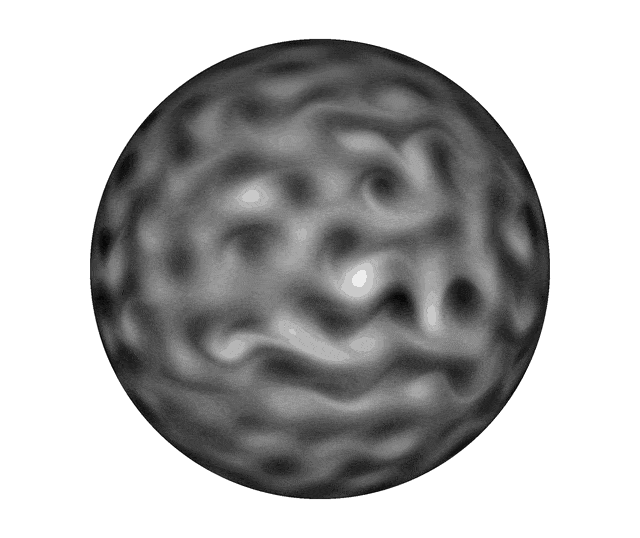
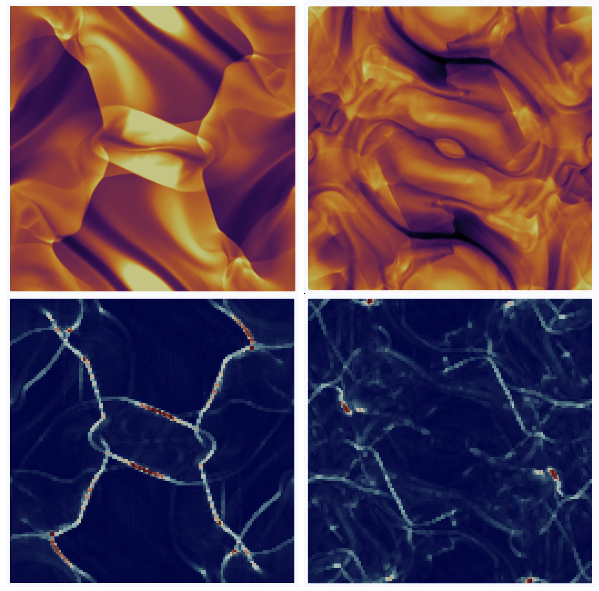
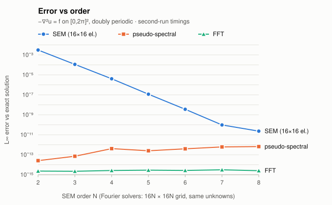
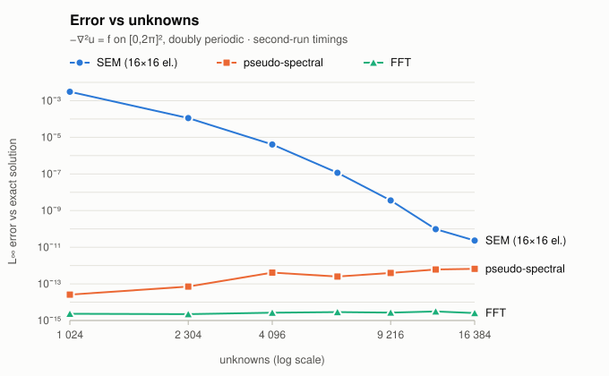
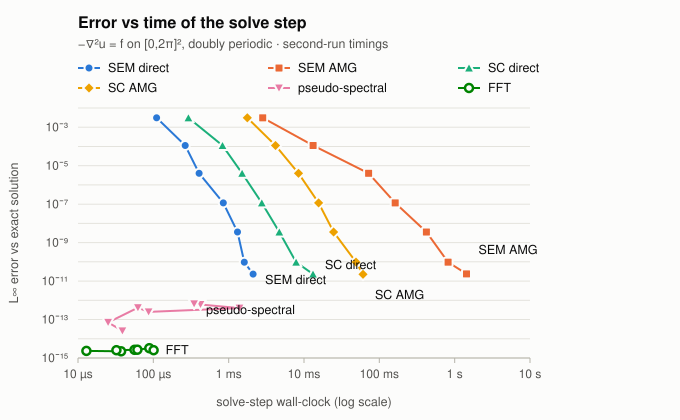
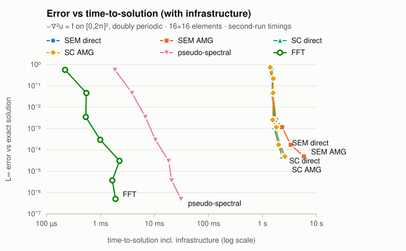

# 

| **Documentation** |
|:------------ |
 [](https://smarras79.github.io/Jexpresso/dev/) [](https://smarras79.github.io/Jexpresso/dev/) |
|**Build Status** |
| [](https://github.com/smarras79/Jexpresso/actions/workflows/CI.yml?query=branch%3Amaster) [](https://github.com/smarras79/Jexpresso/actions/workflows/Documentation.yml?query=branch%3Amaster)
| **Contacts**  |
| [](mailto:smarras@njit.edu) |
| [](mailto:tissaoui@wisc.edu) |
| [](mailto:hang.wang@njit.edu) |
| **Citation** |
| [](https://doi.org/10.48550/arXiv.2401.05624) |

# JEXPRESSO
A CPU and GPU research software for the numerical solution of a system of arbitrary conservation laws using **continuous spectral elements** and finite differences in **1D, 2D, 3D**. DISCLAIMER: this will always be WIP! Contact us to join the team of developers!

Suggested Julia version: 1.11.9

# A note about the use of AI
Jexpresso has been developed by humans since 2021 and continues to be so. Since Spring 2026, AI has been assisting the developers for new problems additions, debugging, and code's documentation. As AI becomes more reliable, we foresee an increased use of it for code development under the direct supervision of a human expert. 
The Jexpresso core team uses Claude whereas some external developers have been successfully using OpenAI's Codex for their own implementations.

# Table of Contents

- [Installation](#installation)
- [Equations](#equations)
  1. [1D wave equation](#1-1d-wave-equation)
  2. [1D shallow water](#2-1d-shallow-water)
  3. [2D Helmholtz](#3-2d-helmholtz)
  4. [2D scalar advection-diffusion](#4-2d-scalar-advection-diffusion)
  5. [2D Euler equations of compressible flows with gravity and passive chemicals](#5-2d-euler-equations-of-compressible-flows-with-gravity-and-passive-chemicals)
  6. [3D Euler equations of compressible flows with gravity](#6-3d-euler-equations-of-compressible-flows-with-gravity)
- [Showcase](#turbulent-abl)
  - [Planet Saturn](#planet-saturn)
  - [Turbulent ABL](#turbulent-abl)
  - [Shallow cumuli](#shallow-cumuli)
- [Examples available in this branch](#examples-available-in-this-branch)
  - [1D shock tube with dynamic SGS (DynSGS) for shock capturing](#1d-shock-tube-with-dynamic-sgs-dynsgs-for-shock-capturing)
  - [1D acoustic wave](#1d-acoustic-wave)
  - [Flow at Mach 3 with forward-facing step](#flow-at-mach-3-with-forward-facing-step)
  - [Kelvin-Helmholtz instability](#kelvin-helmholtz-instability)
  - [Solid elasticicy](#Solid-elasticity)
  - [MHD: magnetized Kelvin-Helmholtz instability](#magneto-hydrodynamics-mhd-magnetized-kelvin-helmholtz-instability)
  - [MHD: Orszag-Tang vortex](#magneto-hydrodynamics-mhd-orszag-tang-vortex)
  - [Cloud simulation: shallow cumuli with BOMEX conditions](#cloud-simulation-shallow-cumuli-with-bomex-conditions)
  - [Shallow water on a spherical shell](#shallow-water-on-a-spherical-shell)
  - [2D Euler equations with buoyancy and two passive tracers](#2d-euler-equations-with-buoyancy-and-two-passive-tracers)
  - [3D Euler equations with buoyancy](#3d-euler-equations-with-buoyancy)
  - [Spectral convergence of the SEM: doubly periodic Poisson problem](#spectral-convergence-of-the-sem-doubly-periodic-poisson-problem) (SEM direct/AMG, static condensation, pseudo-spectral, FFT)
  - [Laguerre semi-infinite element test suite](#laguerre-semi-infinite-element-test-suite)
    - [Test 1: 1D wave equation with Laguerre absorbing layers](#test-1-1d-wave-equation-with-laguerre-semi-infinite-element-absorbing-layers)
    - [Test 2: 1D wave train for linearized shallow water equations](#test-2-1d-wave-train-for-linearized-shallow-water-equations)
    - [Test 3: 2D advection-diffusion equation](#test-3-2d-advection-diffusion-equation)
    - [Test 4: 2D Helmholtz equation](#test-4-2d-helmholtz-equation)
  - [Rising thermal bubble with semi-infinite Laguerre elements for outflows](#rising-thermal-bubble-with-semi-infinite-laguerre-elements-for-outflows)
  - [Hydrostatic linear mountain waves with semi-infinite Laguerre elements for outflows](#hydrostatic-linear-mountain-waves-with-semi-infinite-laguerre-elements-for-outflows)
  - [Non-hydrostatic mountain waves: comparison against WRF](#non-hydrostatic-mountain-waves-comparison-against-wrf)

# Installation:
Follow the instructins in [INSTALL.md](INSTALL.md)

Run into trouble? Check the [FAQ.md](FAQ.md) for common installation and run errors.

If you use Jexpresso please drop us a line to let us know. We'd like to add a link to your paper or work on this page.

Please cite Jexpresso using:

```
@article{tissaoui2024,
  author = {Y. Tissaoui and J. F. Kelly and S. Marras}
  title = {Efficient Spectral Element Method for the Euler Equations on Unbounded Domains},
  volume ={487},
  pages={129080},
  year = {2024},
  journal = {App. Math. Comput.},
}

@inproceedings{marrasJexpresso,
  author    = {S. Marras and Y. Tissaoui and H. Wang and S. Stechmann}
  title     = {Jexpresso V0.1.0: a Julia-language, user-friendly, multi-physics parallel solver for the solution of conservation laws on CPUs and GPUs},
  booktitle = {Proceedings of the 36th Parallel CFD international conference 2025},
  year      = {2025},
  address   = {Merida, Yucatan, Mexico},
  month     = {November},
  organization = {UNAM},
}
```

# Equations:
Jexpresso uses arbitrarily high-order (3rd and above) **continuous spectral elements** to solve

$$\delta\frac{\partial \bf q}{\partial t} + \sum_{i=1}^{nd}\nabla\cdot{{\bf F}_i({\bf q})} = \mu\nabla^2{\bf q} + {\bf S}({\bf q}) + ~{\rm b.c.}$$

where $\delta = 0,1$ simply indicates time-independent equations the vectors ${\bf q}$, ${\bf F}$, and ${\bf S}$ are problem-dependent as shown below,
and are taken to be zero vectors of the appropriate size when not explicitly stated otherwise.

The Julia package [DifferentialEquations.jl](https://docs.sciml.ai/DiffEqDocs/stable/) is used for time discretization and stepping.

In order, we provide tests and results for the following equations:

### 1. 1D wave equation

$${\bf q}=\begin{bmatrix}
u \\
v
\end{bmatrix}\quad {\bf F}=\begin{bmatrix}
v\\
u
\end{bmatrix}$$

### 2. 1D shallow water

$${\bf q}=\begin{bmatrix}
h \\
u
\end{bmatrix}\quad {\bf F}=\begin{bmatrix}
Uh + Hu\\
gh + Uu
\end{bmatrix},$$

where $H$ and $U$ are a reference height and velocity, respectively.

### 3. 2D Helmholtz

$${\bf S}=\begin{bmatrix}
\alpha^2 u + f(x,z)
\end{bmatrix}\quad \mu\nabla^2{\bf q}=\mu\begin{bmatrix}
u_{xx} + u_{zz}
\end{bmatrix},$$

for a constant value of $\alpha$ and $\mu$, which are case-dependent.

### 4. 2D scalar advection-diffusion

$${\bf q}=\begin{bmatrix}
q\\
\end{bmatrix}\quad {\bf F}=\begin{bmatrix}
qu\\
\end{bmatrix}\quad {\bf F}=\begin{bmatrix}
qv\\
\end{bmatrix}\quad \mu\nabla^2{\bf q}=\mu\begin{bmatrix}
q_{xx} + q_{zz}
\end{bmatrix},$$

### 5. 2D Euler equations of compressible flows with gravity and passive chemicals

With $N$ passive chemicals $c_i, \forall i=1,...,N$:

$${\bf q}=\begin{bmatrix}
\rho \\
\rho u\\
\rho v\\
\rho \theta\\
\rho c1\\
...\\
\rho cN
\end{bmatrix}\quad {\bf F1}=\begin{bmatrix}
\rho u\\
\rho u^2 + p\\
\rho u v\\
\rho u \theta\\
\rho u c1\\
...\\
\rho u cN
\end{bmatrix}\quad {\bf F2}=\begin{bmatrix}
\rho v\\
\rho v u\\
\rho v^2 + p\\
\rho v \theta\\
\rho v c1\\
...\\
\rho v cN
\end{bmatrix}\quad {\bf S}=\begin{bmatrix}
0\\
0\\
-\rho g\\
0\\
0\\
...\\
0
\end{bmatrix}\quad \mu\nabla^2{\bf q}=\mu\begin{bmatrix}
0\\
u_{xx} + u_{zz}\\
v_{xx} + v_{zz}\\
\theta_{xx} + \theta_{zz}\\
c1_{xx} + c1_{zz}\\
...\\
cN_{xx} + cN_{zz}
\end{bmatrix}.$$

### 6. 3D Euler equations of compressible flows with gravity

$${\bf q}=\begin{bmatrix}
\rho \\
\rho u\\
\rho v\\
\rho w\\
\rho \theta\\
\end{bmatrix}\quad {\bf F}1=\begin{bmatrix}
\rho u\\
\rho u^2 + p\\
\rho u v\\
\rho u w\\
\rho u \theta\\
\end{bmatrix}\quad {\bf F}2=\begin{bmatrix}
\rho v\\
\rho v u\\
\rho v^2 + p\\
\rho v w\\
\rho v \theta\\
\end{bmatrix}\quad {\bf F3}=\begin{bmatrix}
\rho w\\
\rho w u\\
\rho w v\\
\rho w^2 + p\\
\rho w \theta\\
\end{bmatrix}\quad {\bf S}=\begin{bmatrix}
0\\
0\\
0\\
-\rho g\\
0\\
\end{bmatrix}\quad \mu\nabla^2{\bf q}=\mu\begin{bmatrix}
0\\
u_{xx} + u_{yy} + u_{zz}\\
v_{xx} + v_{yy} + v_{zz}\\
w_{xx} + w_{yy} + w_{zz}\\
\theta_{xx} + \theta_{yy} + \theta_{zz}\\
\end{bmatrix}.$$


If you are interested in contributing, please get in touch:
[Simone Marras](mailto:smarras@njit.edu), [Yassine Tissaoui](mailto:tissaoui@wisc.edu), [Hang Wang](mailto:hang.wang@njit.edu)

## Planet Saturn:
Example of a relatively coarse simulation of the atmosphere of planet Saturn during 500 days.

Original test described by Scott and Polvani "Forced-Dissipative Shallow-Water Turbulence on the Sphere and the Atmospheric Circulation of the Giant Planets" J. Atmos. Sci. Vol 64, 2007



## Turbulent ABL:
Example of coarse simulation of the turbulent atmospheric boundary layer. Domain size: 10240m X 10240m X 3000m using 64x64x24 spectral elements of order 4.
Surface and SGS: Monin-Obukhov Similarity Theory model with Richardson-corrected Smagorinsky.


## Shallow cumuli:
Example of shallow cumuli simulations (right) for the type of Barbados clouds shown on the left: (picture taken from [P. Blossey webpage](https://www.atmos.washington.edu/~bloss/) from U. Washington)


# Examples available in this branch:
Below are just a few pre-packaged examples available in Jexpresso.
To add your own new problem, see [ADD_A_NEW_TEST.md](ADD_A_NEW_TEST.md).


## 1D shock tube with dynamic SGS (DynSGS) for shock capturing:
Classical Sod's tube with shock and expansion.
The DynSGS SGS model by Marras et al. 2015 and later is used to capture the shock.

```julia
using Jexpresso
Jexpresso.run_case("CompEuler", "sod1d")
```


## 1D acoustic wave:
```julia
using Jexpresso
Jexpresso.run_case("CompEuler", "case1")
```


## Flow at Mach 3 with forward-facing step
Classical flow at Mach 3 with DynSGS shock capturing
```julia
using Jexpresso
Jexpresso.run_case("CompEuler", "ffs_step")
```


## Flow at Mach 3 with airfoil
Mach 3 flow over a (non-supersonic) airfoil with exact geometry (i.e. curved elements). DynSGS shock capturing.
```julia
using Jexpresso
Jexpresso.run_case("CompEuler", "naca64A210")
```


## Kelvin-Helmholtz instability
Classical shear-triggered instability test.

```julia
using Jexpresso
Jexpresso.run_case("CompEuler", "kelvinHelmholtzChan2022")
```


## Solid elasticity
Timoshenko's model of elasticity

```julia
using Jexpresso
Jexpresso.run_case("Elasticity", "beam2d")
```

https://github.com/user-attachments/assets/78872c85-e8b5-494f-b95a-4a94aeb5f07f


## Magneto-Hydrodynamics (MHD), magnetized Kelvin-Helmholtz instability:

The problem is defined in [`problems/equations/MHD/kelvinHelmholtzChan2022`](https://github.com/smarras79/Jexpresso/tree/master/problems/equations/MHD/kelvinHelmholtzChan2022).

```julia
using Jexpresso
Jexpresso.run_case("MHD", "kelvinHelmholtzChan2022")
```


## Magneto-Hydrodynamics (MHD), Orszag-Tang vortex:

The classical 2D MHD benchmark, with the setup of Bormanis, Leon & Scheinker,
*Phys. Plasmas* **31**, 012101 (2024): doubly periodic unit square, γ = 5/3,
128×128 points, t ∈ [0, 1]. The problem is defined in
[`problems/equations/MHD/orszagTangBormanis2024`](https://github.com/smarras79/Jexpresso/tree/master/problems/equations/MHD/orszagTangBormanis2024)
(see its `README.md` and `EQUATIONS.md`).

```julia
using Jexpresso
Jexpresso.run_case("MHD", "orszagTangBormanis2024")
```

Stabilized with **DynSGS** — the residual-based, parameter-free dynamic SGS
model of Marras, Nazarov & Giraldo (see [DSGS.md](DSGS.md)).



Top row: density at t = 0.5 s (left) and t = 1.0 s (right).
Bottom row: residual viscosity. Simulation using 120 × 120 4th-order spectral elements in
a unit square.

The solver writes VTK, not PNG. These three figures are rendered from a
finished run by `julia --project=. tools/plot_orszag_tang.jl`; see the
[case README](problems/MHD/orszagTangBormanis2024/README.md#figures).

## Magneto-Hydrodynamics (MHD), flux emergence in the solar atmosphere:

The two-dimensional emergence of a horizontal magnetic flux sheet through a
two-temperature (chromosphere + corona) stratified atmosphere — the nonlinear
Parker instability of Shibata et al. (1989) — with the setup of Son, Jang &
Magara, *ApJS* **277**:46 (2025): γ = 1.05, [0, 80 H₀] × [0, 35 H₀],
t ∈ [0, 54 τ₀]. The problem is defined in
[`problems/MHD/fluxEmergenceSon2025`](problems/MHD/fluxEmergenceSon2025)
(see its `README.md` and `EQUATIONS.md`).

```bash
mpiexec -n 10 julia --project=. src/Jexpresso.jl MHD fluxEmergenceSon2025
```

Stabilized with **DynSGS**, integrated with Carpenter–Kennedy 2N54 on the
coarsest N = 4 grid the problem admits (80×35 elements). The solver writes PNGs
styled after the paper's figures (log₁₀ density on the paper's `jet` scale
with magnetic field lines and velocity vectors; centerline profiles of the
rise velocity, Alfvén speed, field and density on the axes of its Fig. 5)
directly, gathered on one rank under MPI.

[`problems/MHD/brioWu1d`](problems/MHD/brioWu1d) is the 1D Brio–Wu MHD
shock tube (Dao & Nazarov 2022, §5.2), the MHD counterpart of `CompEuler/sod1d`:
DynSGS in its conserved form with the 1D MHD kernel, 600 LGL points, the
reference solution overlaid at t = 0.2.

```bash
julia --project=. src/Jexpresso.jl MHD brioWu1d
```

[`problems/ShallowWater/SoliWaveIslandDSGS`](problems/ShallowWater/SoliWaveIslandDSGS)
is the solitary wave on a conical island of Marras et al. (2018, §5.5)
stabilized by DynSGS for the shallow-water system (`DSGS_SW()`) instead of the
constant viscosity of `ShallowWater/SoliWaveIsland`.

```bash
julia --project=. src/Jexpresso.jl ShallowWater SoliWaveIslandDSGS
```

[`problems/MHD/fluxEmergenceSon2025DSGS`](problems/MHD/fluxEmergenceSon2025DSGS)
is the same problem with **DynSGS alone** keeping the solution admissible:
no positivity limiter, the dissipation acting on the relative departure from
the magnetostatic reference state (`:dsgs_ref_weight`, DSGS.md §4.5).

```bash
mpiexec -n 10 julia --project=. src/Jexpresso.jl MHD fluxEmergenceSon2025DSGS
```

## Cloud simulation: shallow cumuli with BOMEX conditions:

```julia
using Jexpresso
Jexpresso.run_case("CompEuler", "3d_bomex")
```


## Shallow water on a spherical shell
Benchmark: classical Galewki and Polvani's barotropic jet
```julia
using Jexpresso
Jexpresso.run_case("ShallowWater", "SWsphere")
```


This case also ships with **Proper Orthogonal Decomposition** switched on: at
the end of the run the code extracts the energy-ranked modes of the flow, draws
them on an equirectangular map together with the energy spectrum and the
temporal coefficients, and writes the basis out for a reduced-order model.

POD is a property of the framework rather than of this case: **any** problem
turns it on with `:lpod => true` in its deck and supplies nothing else, in 1D,
2D, 3D or on a manifold. `problems/AdvDiff/PODbenchmark` is the reference
benchmark, a problem whose POD is known in closed form. See
[`docs/POD.md`](docs/POD.md).


## 2D Euler equations with buoyancy and two passive tracers
The problem is defined in `problems/equations/CompEuler/thetaTracers`. To run it you would do the following:
```julia
using Jexpresso
Jexpresso.run_case("CompEuler", "thetaTracers")
```


## 3D Euler equations with buoyancy
The problem is defined in `problems/equations/CompEuler/3d`. To run it you would do the following:
```julia
using Jexpresso
Jexpresso.run_case("CompEuler", "3d")
```


## Spectral convergence of the SEM: doubly periodic Poisson problem
The problem is defined in `problems/Elliptic/poisson_periodic_sem`: $-\nabla^2 u = f$ on $[0,2\pi]^2$, periodic in $x$ and $y$, with the exact solution $u = A\,(p(x)\,p(y) - 1/(c^2-1))$, $p(s) = 1/(c-\cos s)$, the product of two periodic Poisson kernels ($c = (r+1/r)/2$ with $r = 0.8$, and $A$ scales the peak to $u(0,0)=1$; see `user_source.jl`). Its Fourier coefficients decay geometrically, like $r^{|k_x|+|k_y|}$, so $u$ is not band-limited: the Fourier solvers have a grid-dependent error too, not just round-off. The same deck solves it six ways:

| solver | deck flags | discretisation | solve |
|---|---|---|---|
| SEM direct | (default) | 16×16 spectral elements of order N (`:nop`) | sparse direct (Cholesky) on the full periodic system |
| SEM AMG | `:linsolve_amg => true` | same | AMG-preconditioned conjugate gradients on the full system |
| SC direct | `:lstatic_condensation => true` | same, statically condensed (below) | sparse Cholesky on the (symmetrised) skeleton system |
| SC AMG | `:lstatic_condensation => true, :EL_skeleton_solver => "amg"` | same, statically condensed | AMG-preconditioned conjugate gradients on the skeleton system |
| pseudo-spectral | `:lpseudospectral => true` | Fourier collocation on a uniform `:fft_N`² grid, Kopriva's derivative matrix (`FourierDerivativeMatrix`) | dense matrix diagonalisation, O(N³) |
| FFT | `:lfft => true` | Fourier spectral on a uniform `:fft_N`² grid | FFTW, O(N² log N) |

**Static condensation (SC)** is the algorithm of element learning (`elementLearning_Axb!`), used here as a solver: the interior unknowns of every element are eliminated with the local operators T^ie = (A_{vo,vo})⁻¹ A_{vo,vb}, computed from the element blocks of the SEM matrix (element learning replaces exactly these with a trained network), which leaves a Schur-complement system on the element skeleton only — 3 840 of the 16 384 unknowns at N = 8. The skeleton system is solved, and the interiors are recovered element by element. Nothing is approximated: SC reproduces the full SEM solution to round-off. On this periodic problem there is no Dirichlet boundary (Γ = ∅), so the skeleton system is singular like the full one; one unknown is pinned and the result is shifted to zero mean, as in every periodic solve. **AMG** is smoothed aggregation (AlgebraicMultigrid.jl) as the preconditioner of conjugate gradients (Krylov.jl), to a relative residual of 10⁻¹²; `:amg_method => "rs"` selects Ruge–Stüben. The same `:EL_skeleton_solver` option applies to the element-learning inference and to the Dirichlet decks (see `problems/Elliptic/poisson_dirichlet_sc`).

The skeleton matrix B is symmetric in exact arithmetic, but the subtraction that forms it leaves a round-off asymmetry (≈1e-16 relative). That was enough for Julia's `factorize`, which tests for exact symmetry, to fall back to UMFPACK LU. `el_skeleton_solve` now symmetrises B as (B + Bᵀ)/2 and factorises it with CHOLMOD Cholesky, like the full system. The table and figures below use Cholesky.

To run it you would do the following:
```julia
using Jexpresso
Jexpresso.run_case("Elliptic", "poisson_periodic_sem")
```

### Benchmark: error and time-to-solution of the six solvers
`tools/periodic_poisson_benchmark/pipeline.jl` runs all six solvers at the same number of unknowns, the four SEM solves at orders N = 2…8 and the two Fourier solvers on 16N × 16N grids, and writes the table below and the figures. Run it from the REPL:
```julia
julia --project=.
julia> using Jexpresso
julia> include("tools/periodic_poisson_benchmark/pipeline.jl")
julia> rows = run_periodic_poisson_benchmark()
```
For higher resolutions, `levels = 0:3` refines the 16×16 mesh uniformly through `:linitial_refine`, up to (16·2^L)² elements. The pipeline can cap the size per solver, resume an interrupted sweep, and draw h-refinement figures of time against unknowns. See [tools/periodic_poisson_benchmark/README.md](tools/periodic_poisson_benchmark/README.md) for running it on a laptop.

**Timing protocol.** Every configuration runs twice in the same Julia session and only the **second run** is recorded, so compilation never enters a number. Each time is a single wall-clock measurement of that run (no repetition, no minimum over samples). The mesh and SEM preprocess caches are switched off, so the SEM infrastructure is built, not loaded from disk, and output files are switched off.

**What the columns mean.**
- **solve**: the solve step alone (triangular solves for SEM direct; the CG iterations for SEM AMG; the skeleton solve plus the interior recovery for SC; four dense N×N products for pseudo-spectral; rfft/scale/brfft for the FFT).
- **setup**: the solver's own infrastructure (periodic reduction, then the Cholesky factorisation or the AMG hierarchy; for SC also the element blocks and the Schur complement; 1-D eigen-decompositions; FFTW plan).
- **solved for / CG its**: the unknowns of the system actually solved (the skeleton for SC) and the conjugate-gradient iterations of the AMG solves.
- **SEM infrastructure**: the mesh read and the SEM setup (basis, metrics, mass and Laplacian assembly). Only the SEM needs it.
- **time-to-solution**: everything the method needs: SEM infrastructure + RHS + setup + solve for the four SEM solves; RHS + setup + solve for the Fourier solvers.
- **run_case wall-clock**: the whole second `run_case` call. The Fourier solvers read no mesh: the driver dispatches to them before any SEM infrastructure is built. The FFT is planned with `FFTW.ESTIMATE` (`:fft_plan => "estimate"`), so its plan is built, and charged to its setup, in every run.

**Reading the results.** The four SEM solves compute the same discrete solution, so their error curves coincide (only the last one drawn is visible). What separates them is cost. AMG on the condensed skeleton system needs far fewer iterations than on the full system, and the gap grows with the order (41 against 138 CG iterations at N = 8): the condensation removes the element-interior modes that make the high-order SEM system hard for AMG, and the skeleton system is also 4× smaller. At N = 8 the SC AMG solve step is 29× faster than the full-system AMG one. The sparse direct solves stay the fastest solve steps at these sizes. For SEM direct, SC direct and SC AMG the time-to-solution is dominated by the SEM infrastructure (1.3–2.4 s, mostly reading and building the mesh); full-system AMG is the exception at high order (3.5 s of solver cost at N = 8).

The pseudo-spectral and FFT errors fall geometrically with the grid, from 5.6e-1 on the 32² grid to 5.0e-7 on the 128² grid, as the r^(N_g/2) decay of the Fourier coefficients predicts. The two compute the same discrete solution, and their errors agree to 6 digits. The SEM error falls exponentially with the order, from 7.3e-1 at N = 2 to 5.0e-5 at N = 8. At the same number of unknowns the Fourier error is about 100× smaller at N = 8: the solution is analytic and periodic, which suits a global Fourier basis, while the SEM gains its accuracy element by element. Likewise the four SEM solvers (direct, AMG, SC direct, SC AMG) compute the same discrete SEM solution, so their errors agree to 3–4 digits (see the table below); the two error plots draw them as a single SEM curve, and the time plots separate them.

<picture>
  <source media="(prefers-color-scheme: dark)" srcset="assets/ppb_error_vs_order-dark.svg">
  
</picture>

<picture>
  <source media="(prefers-color-scheme: dark)" srcset="assets/ppb_error_vs_dofs-dark.svg">
  
</picture>

<picture>
  <source media="(prefers-color-scheme: dark)" srcset="assets/ppb_error_vs_solve_time-dark.svg">
  
</picture>

<picture>
  <source media="(prefers-color-scheme: dark)" srcset="assets/ppb_error_vs_total_time-dark.svg">
  
</picture>

| method | elements | SEM order N | unknowns (grid) | solved for | CG its | ‖e‖∞ | relative ‖e‖₂ | solve | setup | RHS | SEM infrastructure | time-to-solution | run_case wall-clock |
|---|---:|---:|---:|---:|---:|---:|---:|---:|---:|---:|---:|---:|---:|
| SEM direct | 16² | 2 | 1 024 (32²) | 1 024 | — | 7.3e-01 | 3.2e+00 | 152 µs | 3.59 ms | 149 µs | 1.32 s | **1.32 s** | 1.76 s |
| SEM direct | 16² | 3 | 2 304 (48²) | 2 304 | — | 2.2e-01 | 5.1e-01 | 559 µs | 12.9 ms | 468 µs | 1.51 s | **1.53 s** | 2.01 s |
| SEM direct | 16² | 4 | 4 096 (64²) | 4 096 | — | 4.7e-02 | 1.3e-01 | 625 µs | 17 ms | 502 µs | 1.49 s | **1.51 s** | 1.97 s |
| SEM direct | 16² | 5 | 6 400 (80²) | 6 400 | — | 2.5e-03 | 2.0e-03 | 1.11 ms | 34.3 ms | 646 µs | 1.62 s | **1.65 s** | 2.13 s |
| SEM direct | 16² | 6 | 9 216 (96²) | 9 216 | — | 1.2e-03 | 2.8e-03 | 1.81 ms | 72.5 ms | 886 µs | 1.65 s | **1.73 s** | 2.23 s |
| SEM direct | 16² | 7 | 12 544 (112²) | 12 544 | — | 1.7e-04 | 2.5e-04 | 4.69 ms | 155 ms | 1.28 ms | 1.95 s | **2.11 s** | 2.57 s |
| SEM direct | 16² | 8 | 16 384 (128²) | 16 384 | — | 5.0e-05 | 4.0e-05 | 5.84 ms | 256 ms | 1.48 ms | 2.35 s | **2.61 s** | 3.12 s |
| SEM AMG | 16² | 2 | 1 024 (32²) | 1 024 | 31 | 7.3e-01 | 3.2e+00 | 5.66 ms | 2.47 ms | 142 µs | 1.37 s | **1.38 s** | 1.86 s |
| SEM AMG | 16² | 3 | 2 304 (48²) | 2 304 | 46 | 2.2e-01 | 5.1e-01 | 28.9 ms | 7.01 ms | 281 µs | 1.47 s | **1.51 s** | 2 s |
| SEM AMG | 16² | 4 | 4 096 (64²) | 4 096 | 64 | 4.7e-02 | 1.3e-01 | 87.4 ms | 13.5 ms | 450 µs | 1.45 s | **1.56 s** | 2.06 s |
| SEM AMG | 16² | 5 | 6 400 (80²) | 6 400 | 82 | 2.5e-03 | 2.0e-03 | 227 ms | 27 ms | 656 µs | 1.52 s | **1.78 s** | 2.27 s |
| SEM AMG | 16² | 6 | 9 216 (96²) | 9 216 | 102 | 1.2e-03 | 2.8e-03 | 513 ms | 60.9 ms | 1.06 ms | 1.73 s | **2.31 s** | 2.84 s |
| SEM AMG | 16² | 7 | 12 544 (112²) | 12 544 | 117 | 1.7e-04 | 2.5e-04 | 1.43 s | 139 ms | 1.2 ms | 1.77 s | **3.34 s** | 3.81 s |
| SEM AMG | 16² | 8 | 16 384 (128²) | 16 384 | 138 | 5.0e-05 | 4.0e-05 | 3.28 s | 227 ms | 1.49 ms | 2.35 s | **5.86 s** | 6.34 s |
| SC direct | 16² | 2 | 1 024 (32²) | 768 | — | 7.3e-01 | 3.2e+00 | 667 µs | 6.03 ms | 144 µs | 1.49 s | **1.5 s** | 2.02 s |
| SC direct | 16² | 3 | 2 304 (48²) | 1 280 | — | 2.2e-01 | 5.1e-01 | 1.4 ms | 13 ms | 263 µs | 1.52 s | **1.54 s** | 2.03 s |
| SC direct | 16² | 4 | 4 096 (64²) | 1 792 | — | 4.7e-02 | 1.3e-01 | 2.2 ms | 23.9 ms | 443 µs | 1.47 s | **1.5 s** | 2 s |
| SC direct | 16² | 5 | 6 400 (80²) | 2 304 | — | 2.5e-03 | 2.0e-03 | 6.38 ms | 64.2 ms | 874 µs | 1.64 s | **1.71 s** | 2.24 s |
| SC direct | 16² | 6 | 9 216 (96²) | 2 816 | — | 1.2e-03 | 2.8e-03 | 6.83 ms | 71 ms | 900 µs | 1.57 s | **1.65 s** | 2.15 s |
| SC direct | 16² | 7 | 12 544 (112²) | 3 328 | — | 1.7e-04 | 2.5e-04 | 11.1 ms | 120 ms | 1.15 ms | 1.84 s | **1.97 s** | 2.46 s |
| SC direct | 16² | 8 | 16 384 (128²) | 3 840 | — | 5.0e-05 | 4.0e-05 | 37.2 ms | 190 ms | 1.53 ms | 2.09 s | **2.32 s** | 2.79 s |
| SC AMG | 16² | 2 | 1 024 (32²) | 768 | 23 | 7.3e-01 | 3.2e+00 | 3.38 ms | 4.97 ms | 144 µs | 1.38 s | **1.39 s** | 1.97 s |
| SC AMG | 16² | 3 | 2 304 (48²) | 1 280 | 26 | 2.2e-01 | 5.1e-01 | 9 ms | 12.3 ms | 276 µs | 1.57 s | **1.59 s** | 2.06 s |
| SC AMG | 16² | 4 | 4 096 (64²) | 1 792 | 30 | 4.7e-02 | 1.3e-01 | 17.6 ms | 21.1 ms | 413 µs | 1.54 s | **1.58 s** | 2.11 s |
| SC AMG | 16² | 5 | 6 400 (80²) | 2 304 | 33 | 2.5e-03 | 2.0e-03 | 29.1 ms | 37.8 ms | 661 µs | 1.48 s | **1.55 s** | 2.03 s |
| SC AMG | 16² | 6 | 9 216 (96²) | 2 816 | 36 | 1.2e-03 | 2.8e-03 | 44.4 ms | 66.7 ms | 881 µs | 1.69 s | **1.81 s** | 2.3 s |
| SC AMG | 16² | 7 | 12 544 (112²) | 3 328 | 39 | 1.7e-04 | 2.5e-04 | 68.7 ms | 113 ms | 1.17 ms | 1.81 s | **1.99 s** | 2.44 s |
| SC AMG | 16² | 8 | 16 384 (128²) | 3 840 | 41 | 5.0e-05 | 4.0e-05 | 112 ms | 176 ms | 1.48 ms | 2.31 s | **2.6 s** | 3.08 s |
| pseudo-spectral | — | — | 1 024 (32²) | 1 024 | — | 5.6e-01 | 1.5e+00 | 14.3 µs | 1.71 ms | 129 µs | — | **1.85 ms** | 480 ms |
| pseudo-spectral | — | — | 2 304 (48²) | 2 304 | — | 4.6e-02 | 9.9e-02 | 36.2 µs | 3.56 ms | 233 µs | — | **3.83 ms** | 443 ms |
| pseudo-spectral | — | — | 4 096 (64²) | 4 096 | — | 3.5e-03 | 5.0e-03 | 127 µs | 6.25 ms | 384 µs | — | **6.76 ms** | 499 ms |
| pseudo-spectral | — | — | 6 400 (80²) | 6 400 | — | 3.0e-04 | 2.4e-04 | 167 µs | 9.55 ms | 664 µs | — | **10.4 ms** | 496 ms |
| pseudo-spectral | — | — | 9 216 (96²) | 9 216 | — | 3.1e-05 | 1.5e-05 | 422 µs | 16.2 ms | 1.59 ms | — | **18.2 ms** | 551 ms |
| pseudo-spectral | — | — | 12 544 (112²) | 12 544 | — | 3.8e-06 | 1.7e-06 | 503 µs | 19.1 ms | 1.2 ms | — | **20.8 ms** | 476 ms |
| pseudo-spectral | — | — | 16 384 (128²) | 16 384 | — | 5.0e-07 | 2.3e-07 | 631 µs | 28.7 ms | 1.54 ms | — | **30.9 ms** | 482 ms |
| FFT | — | — | 1 024 (32²) | 1 024 | — | 5.6e-01 | 1.5e+00 | 12.1 µs | 97.4 µs | 110 µs | — | **220 µs** | 440 ms |
| FFT | — | — | 2 304 (48²) | 2 304 | — | 4.6e-02 | 9.9e-02 | 39.4 µs | 211 µs | 297 µs | — | **547 µs** | 461 ms |
| FFT | — | — | 4 096 (64²) | 4 096 | — | 3.5e-03 | 5.0e-03 | 36 µs | 125 µs | 370 µs | — | **531 µs** | 473 ms |
| FFT | — | — | 6 400 (80²) | 6 400 | — | 3.0e-04 | 2.4e-04 | 93 µs | 269 µs | 626 µs | — | **988 µs** | 453 ms |
| FFT | — | — | 9 216 (96²) | 9 216 | — | 3.1e-05 | 1.5e-05 | 196 µs | 482 µs | 1.56 ms | — | **2.24 ms** | 509 ms |
| FFT | — | — | 12 544 (112²) | 12 544 | — | 3.8e-06 | 1.7e-06 | 160 µs | 299 µs | 1.19 ms | — | **1.65 ms** | 466 ms |
| FFT | — | — | 16 384 (128²) | 16 384 | — | 5.0e-07 | 2.3e-07 | 214 µs | 172 µs | 1.51 ms | — | **1.9 ms** | 438 ms |

To regenerate the figures from an existing `results.csv`: `python3 tools/periodic_poisson_benchmark/plot.py`.

## Laguerre semi-infinite element test suite
This section contains instructions to run all of the test cases presented in

```
@article{tissaoui2024,
  author = {Y. Tissaoui and J. F. Kelly and S. Marras}
  title = {Efficient Spectral Element Method for the Euler Equations on Unbounded Domains},
  volume ={487},
  pages={129080},
  year = {2024},
  journal = {App. Math. Comput.},
}
```

### Test 1: 1D wave equation with Laguerre semi-infinite element absorbing layers

The problem is defined in [`problems/CompEuler/wave1d_lag`](https://github.com/smarras79/Jexpresso/tree/master/problems/equations/CompEuler/wave1d_lag) and by default output will be written to `output/CompEuler/wave1d_lag`. To solve this problem run the following commands from the Julia command line:

```julia
using Jexpresso
Jexpresso.run_case("CompEuler", "wave1d_lag")
```


### Test 2: 1D wave train for linearized shallow water equations

The problem is defined in [`problems/equations/AdvDiff/Wave_Train`](https://github.com/smarras79/Jexpresso/tree/master/problems/equations/AdvDiff/Wave_Train) and by default output will be written to `output/AdvDiff/Wave_Train`. To solve this problem run the following commands from the Julia command line:

```julia
using Jexpresso
Jexpresso.run_case("AdvDiff", "Wave_Train")
```


### Test 3: 2D advection-diffusion equation

The problem is defined in [`problems/equations/AdvDiff/2D_laguerre`](https://github.com/smarras79/Jexpresso/tree/master/problems/equations/AdvDiff/2d_Laguerre) and by default output will be written to `output/AdvDiff/2D_laguerre`. To solve this problem run the following commands from the Julia command line:

```julia
using Jexpresso
Jexpresso.run_case("AdvDiff", "2D_laguerre")
```


### Test 4: 2D Helmholtz equation

The problem is defined in [`problems/equations/Helmholtz/case1_laguerre`](https://github.com/smarras79/Jexpresso/tree/master/problems/equations/Helmholtz/case1_laguerre) and by default output will be written to `output/Helmholtz/case1_laguerre`. To solve this problem run the following commands from the Julia command line:

```julia
using Jexpresso
Jexpresso.run_case("Helmholtz", "case1_laguerre")
```


## Rising thermal bubble with semi-infinite Laguerre elements for outflows

The problem is defined in [`problems/equations/CompEuler/theta_laguerre`](https://github.com/smarras79/Jexpresso/tree/master/problems/equations/CompEuler/theta_laguerre) and by default output will be written to `output/CompEuler/theta_laguerre`. To solve this problem run the following commands from the Julia command line:

```julia
using Jexpresso
Jexpresso.run_case("CompEuler", "theta_laguerre")
```


## Hydrostatic linear mountain waves with semi-infinite Laguerre elements for outflows

The problem is defined in [`problems/equations/CompEuler/HSmount_Lag`](https://github.com/smarras79/Jexpresso/tree/master/problems/equations/CompEuler/HSmount_Lag) and by default output will be written to `output/CompEuler/HSmount_Lag`. To solve this problem run the following commands from the Julia command line:

```bash      
using Jexpresso
Jexpresso.run_case("CompEuler", "HSmount_Lag")
```


## Non-hydrostatic mountain waves: comparison against WRF


